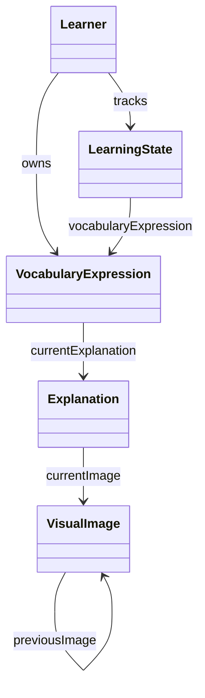

# 共通ドメインモデル

## Source-of-Truth Index

| 文書 | 正本となる概念 | 役割 |
|---|---|---|
| [learner.md](./learner.md) | `Learner`、`AuthenticationSubject` | 学習者の所有境界と外部 identity 境界 |
| [vocabulary-expression.md](./vocabulary-expression.md) | `VocabularyExpression`、`VocabularyExpressionText`、`NormalizedVocabularyExpressionText` | 学習者が所有する登録対象と解説生成状態 |
| [learning-state.md](./learning-state.md) | `LearningState`、`Proficiency` | 学習進捗と習熟度 |
| [explanation.md](./explanation.md) | `Explanation`、`Frequency`、`Sophistication` | 解説本文と画像生成状態 |
| [visual.md](./visual.md) | `VisualImage`、`StorageReference` | 画像アセットと履歴 |
| [service.md](./service.md) | external port catalog | 外部責務の境界 |

## 集約関係の概要

- `Learner` は所有境界であり、認証方式そのものは保持しない
- `VocabularyExpression` は学習者が所有する登録対象で、単語と連語を同一概念で扱う
- `Explanation` は `VocabularyExpression` の完了済み解説結果を表す
- `VisualImage` は `Explanation` に属する独立集約で、履歴を保持する
- `LearningState` は `Learner` と `VocabularyExpression` の関係上にある習熟度専用集約である

## 正規用語と移行メモ

| 正規用語 | 非推奨 / 旧称 | 補足 |
|---|---|---|
| `VocabularyExpression` | `Entry` | 学習者が所有する登録対象の正規名称 |
| `LearningState` | `EntryLearningState` | 学習進捗の正規名称 |
| `VocabularyExpressionText` | `EntryExpressionText` | 登録時の文字列表現 |
| `NormalizedVocabularyExpressionText` | `NormalizedEntryExpressionText` | 重複判定用の正規化表現 |

- 旧称はこの移行メモ以外では使わない
- 外部向け説明で日本語を併記する場合も、英語の正規名称は上表に合わせる

## 命名規約

- 識別子型は必ず `XxxIdentifier` 形式にする
- 集約自身の識別子フィールド名は常に `identifier` にする
- 他集約や他概念への参照フィールドは `learner`、`vocabularyExpression`、`currentExplanation`、`currentImage` のように概念名そのものを使う
- 派生命名は `VocabularyExpression*` / `LearningState*` に統一する
- 文字列表現の値オブジェクト名は `VocabularyExpressionText` と `NormalizedVocabularyExpressionText` を採用する

## 概念分離

| 概念 | 所有者 | 混同してはならない対象 |
|---|---|---|
| `Frequency` | `Explanation` | `Sophistication`、`Proficiency`、生成状態 |
| `Sophistication` | `Explanation` | `Frequency`、`Proficiency`、登録状態 |
| `Proficiency` | `LearningState` | `Frequency`、`Sophistication`、生成状態 |
| `RegistrationStatus` | `VocabularyExpression` | 解説生成状態、画像生成状態 |
| `ExplanationGenerationStatus` | `VocabularyExpression` | `ImageGenerationStatus`、`RegistrationStatus` |
| `ImageGenerationStatus` | `Explanation` | `ExplanationGenerationStatus`、`Proficiency` |

## 非同期表示の共通ルール

- ユーザーへ見せてよい生成物は完了済みの `currentExplanation` と `currentImage` だけである
- regenerate 開始時に `currentExplanation` / `currentImage` を消してはならない
- 新しい解説または画像が `succeeded` になった時だけ current 参照を切り替える
- 生成中または失敗中は状態表示だけを行い、不完全な生成物は表示しない

## Deferred Scope / Follow-on Boundaries

- credential 管理、session 管理、provider ごとの認証導線は auth/session 設計で扱う
- command 受理、dispatch failure、workflow orchestration は backend command 設計で扱う
- query model、永続化マッピング、adapter 実装、ベンダー固有 SDK はこの文書群の対象外とする
- この文書群は project-wide domain language の正本であり、後続 feature はここで固定した概念境界を前提にする
