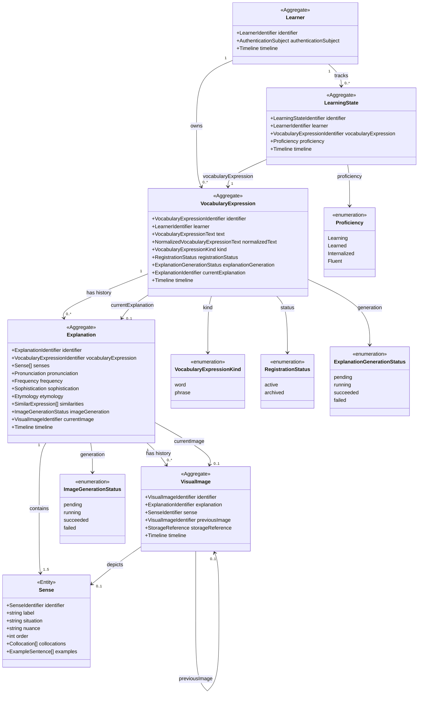

# Data Model: ドメインモデリング

## Class Diagram

- `Sense` は `Explanation` が所有する意味単位の内部エンティティである
- `VisualImage` は `Explanation` と `sense?` の両方を参照できる独立集約である
- `Explanation.currentImage` はこの phase では単一の current 参照を維持する
- `Learner`、`VocabularyExpression`、`LearningState` の ownership boundary は変えない

## Aggregate: Learner

**Purpose**: 学習者本人を表す所有境界。自身が所有する `VocabularyExpression` と `LearningState` の起点となる。

| Field | Type | Cardinality | Description |
|-------|------|-------------|-------------|
| identifier | LearnerIdentifier | 1 | 学習者識別子 |
| authenticationSubject | AuthenticationSubject | 1 | 外部 identity と結びつく参照 |
| timeline | Timeline | 1 | 作成・更新日時 |

**Validation rules**:

- `authenticationSubject` は stable で一意でなければならない
- `Learner` は credential や session を保持しない

## Aggregate: VocabularyExpression

**Purpose**: 学習者が所有する登録対象となる英語表現。単語と連語を同一概念で扱う。

| Field | Type | Cardinality | Description |
|-------|------|-------------|-------------|
| identifier | VocabularyExpressionIdentifier | 1 | 登録対象の一意識別子 |
| learner | LearnerIdentifier | 1 | 所有学習者 |
| text | VocabularyExpressionText | 1 | ユーザーが登録した英語表現 |
| normalizedText | NormalizedVocabularyExpressionText | 1 | 重複判定に使う正規化表現 |
| kind | VocabularyExpressionKind | 1 | 単語か連語かの分類 |
| registrationStatus | RegistrationStatus | 1 | 登録状態 |
| explanationGeneration | ExplanationGenerationStatus | 1 | 解説生成状態 |
| currentExplanation | ExplanationIdentifier | 0..1 | 現在表示中の完了済み解説 |
| timeline | Timeline | 1 | 作成・更新日時 |

**Validation rules**:

- `learner + normalizedText` は同一学習者内で一意でなければならない
- `kind` は `word` または `phrase`
- `currentExplanation` は同じ `VocabularyExpression` に属する完了済み `Explanation` だけを参照できる
- 解説再生成中または再生成失敗時でも、直前の完了済み解説がある場合は `currentExplanation` を保持してよい

**State transitions**:

- `registrationStatus`: `active -> archived`
- `explanationGeneration`: `pending -> running -> succeeded | failed`
- `explanationGeneration`: `failed -> pending` を retry として許可
- `explanationGeneration`: `succeeded -> running` を regenerate として許可

## Aggregate: Explanation

**Purpose**: `VocabularyExpression` に紐づく生成済み解説を表す知識集約。意味単位として `Sense` を持ち、現在表示中画像の参照を持つ。

| Field | Type | Cardinality | Description |
|-------|------|-------------|-------------|
| identifier | ExplanationIdentifier | 1 | 解説識別子 |
| vocabularyExpression | VocabularyExpressionIdentifier | 1 | 元の登録対象 |
| senses | Sense[] | 1..5 | 意味単位の一覧 |
| pronunciation | Pronunciation | 1 | 発音と発音記号 |
| frequency | Frequency | 1 | 頻出度と理由 |
| sophistication | Sophistication | 1 | 知的度と理由 |
| etymology | Etymology | 1 | 語源 |
| similarities | SimilarExpression[] | 1..5 | 類似表現 |
| imageGeneration | ImageGenerationStatus | 1 | 画像生成状態 |
| currentImage | VisualImageIdentifier | 0..1 | 現在表示中の完了済み画像 |
| timeline | Timeline | 1 | 作成・更新日時 |

**Validation rules**:

- `vocabularyExpression` は常に 1 つの `VocabularyExpressionIdentifier` を参照する
- `senses` は 1 件以上 5 件以下
- `senses.order` は同一 `Explanation` 内で重複してはならない
- `senses.identifier` は同一 `Explanation` 内で一意でなければならない
- `currentImage` は同じ `Explanation` に属する完了済み `VisualImage` だけを参照できる
- `currentImage` が `sense` を持つ画像を指す場合、その `sense` は同じ `Explanation.senses` のいずれかでなければならない
- 画像再生成中または再生成失敗時でも、直前の完了済み画像がある場合は `currentImage` を保持してよい
- `frequency` と `sophistication` は `Explanation` が所有し、`Sense` や `LearningState` へ移してはならない

**State transitions**:

- `imageGeneration`: `pending -> running -> succeeded | failed`
- `imageGeneration`: `failed -> pending` を retry として許可
- `imageGeneration`: `succeeded -> running` を regenerate として許可

## Entity: Sense

**Purpose**: `Explanation` が所有する意味単位。意味ごとの説明、状況、ニュアンス、例文、コロケーションをまとめる。

| Field | Type | Cardinality | Description |
|-------|------|-------------|-------------|
| identifier | SenseIdentifier | 1 | 同一 `Explanation` 内での意味識別子 |
| label | string | 1 | 意味を短く表す代表ラベル |
| situation | string | 1 | 使われる状況 |
| nuance | string | 1 | ニュアンス |
| order | positive integer | 1 | 表示順序 |
| collocations | Collocation[] | 0..5 | その意味に結びつくコロケーション |
| examples | ExampleSentence[] | 0..3 | その意味に結びつく例文 |

**Validation rules**:

- `label` は 1 文字以上 255 文字以下
- `situation` は 1 文字以上 255 文字以下
- `nuance` は 1 文字以上 255 文字以下
- `order` は 1 以上の整数
- `collocations` は 5 件以下
- `examples` は 3 件以下
- `examples` と `collocations` は `Explanation` 全体ではなく、その `Sense` の意味に対応していなければならない

## Aggregate: VisualImage

**Purpose**: `Explanation` に基づく視覚的表現を表す画像集約。独立した保存先参照と履歴を持ち、必要に応じて特定の `Sense` を描写する。

| Field | Type | Cardinality | Description |
|-------|------|-------------|-------------|
| identifier | VisualImageIdentifier | 1 | 画像識別子 |
| explanation | ExplanationIdentifier | 1 | 生成元解説 |
| sense | SenseIdentifier | 0..1 | 画像が描写する意味単位 |
| previousImage | VisualImageIdentifier | 0..1 | 同一解説内の直前画像履歴 |
| storageReference | StorageReference | 1 | 永続化先の再取得参照 |
| timeline | Timeline | 1 | 作成・更新日時 |

**Validation rules**:

- `storageReference` は安定した取得参照でなければならない
- 同一 `identifier` は 1 つの保存先だけを指す
- `previousImage` を持つ場合、その `VisualImage` は同じ `Explanation` に属していなければならない
- `sense` を持つ場合、その `Sense` は同じ `Explanation` に属していなければならない
- `previousImage` の循環参照を作ってはならない
- `previousImage` が `sense` を持つ画像で、現在画像も `sense` を持つ場合、両者は同じ `Sense` を指していなければならない

## Aggregate: LearningState

**Purpose**: 学習者ごとの習熟状態を表す集約。語彙自体の属性と学習進捗を分離する。

| Field | Type | Cardinality | Description |
|-------|------|-------------|-------------|
| identifier | LearningStateIdentifier | 1 | 学習状態識別子 |
| learner | LearnerIdentifier | 1 | 対象学習者 |
| vocabularyExpression | VocabularyExpressionIdentifier | 1 | 対象登録表現 |
| proficiency | Proficiency | 1 | 習熟度 |
| timeline | Timeline | 1 | 作成・更新日時 |

**Validation rules**:

- `learner + vocabularyExpression` は一意でなければならない
- `vocabularyExpression` は必ず同じ `learner` が所有する `VocabularyExpression` でなければならない
- `proficiency` は `Learning`、`Learned`、`Internalized`、`Fluent` のいずれか

## Value Objects

### VocabularyExpressionKind

- `word`
- `phrase`

### RegistrationStatus

- `active`
- `archived`

### ExplanationGenerationStatus

- `pending`
- `running`
- `succeeded`
- `failed`

### ImageGenerationStatus

- `pending`
- `running`
- `succeeded`
- `failed`

### Existing value objects retained

- `AuthenticationSubject`
- `Pronunciation`
- `Frequency`
- `Sophistication`
- `Collocation`
- `ExampleSentence`
- `SimilarExpression`
- `Etymology`
