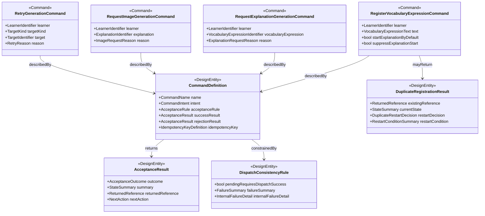

# Data Model: バックエンド Command 設計

## Command Design Overview

## Design Entity: CommandDefinition

**Purpose**: backend command ごとの受理対象、前提条件、冪等性、即時応答を表す。

| Field | Type | Cardinality | Description |
|-------|------|-------------|-------------|
| name | CommandName | 1 | command の正規名称 |
| intent | CommandIntent | 1 | 何を変えようとする command か |
| acceptanceRule | AcceptanceRule | 1 | 受理条件、拒否条件、重複時扱い |
| successResult | AcceptanceResult | 1 | 受理時の即時応答 |
| rejectionResult | AcceptanceResult | 1 | 不受理時の即時応答 |
| idempotencyKey | IdempotencyKeyDefinition | 1 | 同一業務要求の畳み込み規則 |

**Validation rules**:

- `name` は command catalog 内で一意でなければならない
- `successResult` は未完了成果物本体を含んではならない
- `rejectionResult` は内部 failure detail を含んではならない

## Command: RegisterVocabularyExpressionCommand

**Purpose**: 学習者所有の新規 `VocabularyExpression` を登録し、通常は解説生成開始まで受け付ける。

| Field | Type | Cardinality | Description |
|-------|------|-------------|-------------|
| learner | LearnerIdentifier | 1 | 登録主体 |
| text | VocabularyExpressionText | 1 | 登録対象表現 |
| startExplanationByDefault | boolean | 1 | 通常経路では `true` とみなす |
| suppressExplanationStart | boolean | 1 | `true` の場合は登録のみ受理する |

**Acceptance rules**:

- `learner + normalizedText` が未登録なら新規登録候補として扱う
- `suppressExplanationStart = false` の場合、登録と解説生成開始を一体として受理対象にする
- 重複登録時は新規作成を行わず、既存 `VocabularyExpression` と現在状態を返す
- 重複登録時でも、既存状態が `not-started` または `failed` で、かつ `suppressExplanationStart = false` の場合だけ生成開始を再受理する
- 既存状態が `pending`、`running`、`succeeded`、または `suppressExplanationStart = true` の場合は追加生成を開始しない

**State impact**:

- 新規登録時のみ登録対象を作成する
- 解説生成開始を伴う場合のみ、dispatch 成功後に初期状態を確定する
- 重複登録かつ再開条件を満たす場合は既存登録対象を再利用し、新規 `VocabularyExpression` は作成しない
- dispatch 不成立時は登録受付全体を失敗として扱い、受付済み状態を確定しない

## Command: RequestExplanationGenerationCommand

**Purpose**: 既存 `VocabularyExpression` に対して解説生成開始または再生成を受け付ける。

| Field | Type | Cardinality | Description |
|-------|------|-------------|-------------|
| learner | LearnerIdentifier | 1 | 操作主体 |
| vocabularyExpression | VocabularyExpressionIdentifier | 1 | 対象登録表現 |
| reason | ExplanationRequestReason | 1 | 初回生成か再生成かの意図 |

**Acceptance rules**:

- 対象 `VocabularyExpression` は同じ `learner` の所有物でなければならない
- 同一業務キーで `pending` / `running` が存在する場合は重複として扱い、既存状態を返す
- dispatch 成功前に `pending` を確定してはならない

## Command: RequestImageGenerationCommand

**Purpose**: 完了済み `Explanation` に対して画像生成開始または再生成を受け付ける。

| Field | Type | Cardinality | Description |
|-------|------|-------------|-------------|
| learner | LearnerIdentifier | 1 | 操作主体 |
| explanation | ExplanationIdentifier | 1 | 対象解説 |
| reason | ImageRequestReason | 1 | 初回生成か再生成かの意図 |

**Acceptance rules**:

- 対象 `Explanation` は同じ学習者所有の `VocabularyExpression` に属さなければならない
- `Explanation` が完了済みでない場合は受理してはならない
- 同一業務キーで `pending` / `running` が存在する場合は既存状態を返す

## Command: RetryGenerationCommand

**Purpose**: 失敗済みの生成要求に対して、同一業務キーまたは明示的再生成理由で再受理する。

| Field | Type | Cardinality | Description |
|-------|------|-------------|-------------|
| learner | LearnerIdentifier | 1 | 操作主体 |
| targetKind | TargetKind | 1 | explanation か image か |
| target | TargetIdentifier | 1 | 対象識別子 |
| reason | RetryReason | 1 | 再試行理由 |

**Acceptance rules**:

- `failed` 状態の対象に対してのみ再試行として受理する
- `succeeded` 状態に対する再要求は retry ではなく regenerate として扱う
- retry でも user-visible content は返さず、状態要約のみ返す

## Design Entity: AcceptanceResult

**Purpose**: command が利用者へ返す即時応答の構造を表す。

| Field | Type | Cardinality | Description |
|-------|------|-------------|-------------|
| outcome | AcceptanceOutcome | 1 | accepted / reused-existing / rejected / failed |
| summary | StateSummary | 1 | 利用者向けの状態要約 |
| returnedReference | ReturnedReference | 0..1 | 既存対象または新規対象の参照 |
| nextAction | NextAction | 0..1 | 利用者が取れる次の行動 |

**Validation rules**:

- `summary` は未完了成果物本文や画像本体を含んではならない
- `outcome = reused-existing` の場合は `returnedReference` が必須
- `outcome = failed` の場合も provider / dispatch の内部詳細を直接含めない

## Design Entity: DuplicateRegistrationResult

**Purpose**: 重複登録時に既存対象を返しつつ、生成再開可否の判断を表す。

| Field | Type | Cardinality | Description |
|-------|------|-------------|-------------|
| existingReference | ReturnedReference | 1 | 既存 `VocabularyExpression` への参照 |
| currentState | StateSummary | 1 | 現在の登録・生成状態の要約 |
| restartDecision | DuplicateRestartDecision | 1 | 再開するかしないかの判定 |
| restartCondition | RestartConditionSummary | 1 | 判定条件の要約 |

**Validation rules**:

- `restartDecision = restart-accepted` は既存状態が `not-started` または `failed` で、`suppressExplanationStart = false` の場合に限る
- `restartDecision = no-restart` は `pending`、`running`、`succeeded`、または開始抑止時に使う
- `currentState` は未完了成果物本体を含んではならない

## Design Entity: DispatchConsistencyRule

**Purpose**: command 受付確定と workflow dispatch の整合規則を表す。

| Field | Type | Cardinality | Description |
|-------|------|-------------|-------------|
| pendingRequiresDispatchSuccess | boolean | 1 | `true` 固定。dispatch 成功前に `pending` を確定しない |
| failureSummary | FailureSummary | 1 | 利用者向けの失敗要約 |
| internalFailureDetail | InternalFailureDetail | 1 | 内部観測用の詳細失敗情報 |

**Validation rules**:

- `pendingRequiresDispatchSuccess` は常に `true`
- user-visible summary と internal failure detail を混在させてはならない

## Enumerations

### AcceptanceOutcome

- `accepted`
- `reused-existing`
- `rejected`
- `failed`

### DuplicateRestartDecision

- `restart-accepted`
- `no-restart`

### CommandName

- `registerVocabularyExpression`
- `requestExplanationGeneration`
- `requestImageGeneration`
- `retryGeneration`

### CommandIntent

- `register`
- `start-explanation`
- `start-image`
- `retry-or-regenerate`
