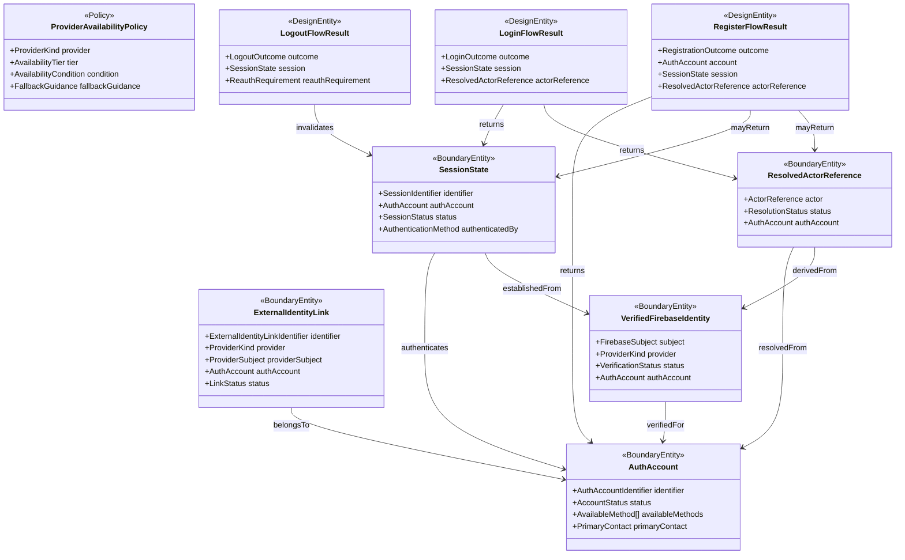

# Data Model: 会員登録・ログイン・ログアウト設計

## Auth Design Overview

## Boundary Entity: AuthAccount

**Purpose**: 会員登録済みの利用単位と、利用可能な認証手段を表す。

| Field | Type | Cardinality | Description |
|-------|------|-------------|-------------|
| identifier | AuthAccountIdentifier | 1 | 会員アカウント識別子 |
| status | AccountStatus | 1 | active / disabled / pending-verification などの利用可否 |
| availableMethods | AvailableMethod[] | 1..* | `Basic`、`Google` など利用可能な認証手段 |
| primaryContact | PrimaryContact | 0..1 | メールアドレスなど主要連絡先 |

**Validation rules**:

- 同じ会員アカウントに同一 provider subject を重複リンクしてはならない
- `status = disabled` の場合は新規 login を受理してはならない

## Boundary Entity: ExternalIdentityLink

**Purpose**: 外部 provider 側の本人識別情報と会員アカウントの対応を表す。

| Field | Type | Cardinality | Description |
|-------|------|-------------|-------------|
| identifier | ExternalIdentityLinkIdentifier | 1 | link 識別子 |
| provider | ProviderKind | 1 | Basic / Google / Apple / LINE |
| providerSubject | ProviderSubject | 1 | provider 側の一意 subject |
| authAccount | AuthAccount | 1 | 紐づく会員アカウント |
| status | LinkStatus | 1 | active / inactive |

**Validation rules**:

- 同一 `provider + providerSubject` は複数会員へ紐づけてはならない
- `Basic` の場合は primary contact と Firebase Authentication 上の credential owner が整合しなければならない

## Boundary Entity: VerifiedFirebaseIdentity

**Purpose**: Flutter client が Firebase Authentication で sign-in した後に、backend が
Firebase ID token を検証して確定する認証済み subject を表す。Firebase Authentication の
`uid` はこの境界では `FirebaseSubject` として扱う。

| Field | Type | Cardinality | Description |
|-------|------|-------------|-------------|
| subject | FirebaseSubject | 1 | backend が検証済みと判断した Firebase subject |
| provider | ProviderKind | 1 | Basic / Google / Apple / LINE のどの経路で sign-in したか |
| status | VerificationStatus | 1 | verified / rejected |
| authAccount | AuthAccount | 0..1 | 解決済みまたは対応候補の会員アカウント |

**Validation rules**:

- `status = rejected` の場合は actor resolution へ進めてはならない
- raw Firebase ID token や refresh token を app core 側の handoff object に含めてはならない

## Boundary Entity: SessionState

**Purpose**: 現在の利用可能状態とその終了状態を表す。

| Field | Type | Cardinality | Description |
|-------|------|-------------|-------------|
| identifier | SessionIdentifier | 1 | session 識別子 |
| authAccount | AuthAccount | 1 | 認証済み会員 |
| status | SessionStatus | 1 | active / invalidated / expired |
| authenticatedBy | AuthenticationMethod | 1 | どの手段で成立したか |

**Validation rules**:

- `status = invalidated` または `expired` の session では protected operation を通してはならない
- logout 成功時は対象 session を `active` のまま残してはならない
- session は backend が検証済みの Firebase identity と actor resolution が揃った後にのみ `active` として確定してよい

## Boundary Entity: ResolvedActorReference

**Purpose**: 認証境界からアプリ本体へ handoff する正規化済み利用主体参照を表す。

| Field | Type | Cardinality | Description |
|-------|------|-------------|-------------|
| actor | ActorReference | 1 | アプリ本体が受け取る利用主体参照 |
| status | ResolutionStatus | 1 | resolved / unresolved |
| authAccount | AuthAccount | 1 | 対応元の会員アカウント |

**Validation rules**:

- `status = unresolved` の場合は login / registration を成功として返してはならない
- `actor` は provider token、Firebase ID token、refresh token、credential detail を含んではならない

## Policy: ProviderAvailabilityPolicy

**Purpose**: provider ごとの採用 tier と有効化条件を表す。

| Field | Type | Cardinality | Description |
|-------|------|-------------|-------------|
| provider | ProviderKind | 1 | 対象 provider |
| tier | AvailabilityTier | 1 | baseline / conditional / unavailable |
| condition | AvailabilityCondition | 1 | 有効化条件または無効理由 |
| fallbackGuidance | FallbackGuidance | 0..1 | 利用不可時の案内 |

**Validation rules**:

- `Basic` と `Google` は初期状態で `baseline` でなければならず、Firebase Authentication 経由で利用可能でなければならない
- `Apple` と `LINE` は追加コストなし条件を満たさない限り `conditional` または `unavailable` とする

## Flow Result: RegisterFlowResult

**Purpose**: 会員登録導線の最終結果を表す。

| Field | Type | Cardinality | Description |
|-------|------|-------------|-------------|
| outcome | RegistrationOutcome | 1 | registered / reused-existing / rejected / failed |
| account | AuthAccount | 0..1 | 登録または再利用対象 |
| session | SessionState | 0..1 | 登録直後に有効化された session |
| actorReference | ResolvedActorReference | 0..1 | アプリ本体へ handoff できる参照 |

**Validation rules**:

- `outcome = registered` でも backend の Firebase identity 検証と actor resolution が完了していなければ成功として見せてはならない
- 重複登録時は `outcome = reused-existing` とし、新規会員を作成してはならない

## Flow Result: LoginFlowResult

**Purpose**: ログイン導線の最終結果を表す。

| Field | Type | Cardinality | Description |
|-------|------|-------------|-------------|
| outcome | LoginOutcome | 1 | logged-in / rejected / failed |
| session | SessionState | 0..1 | 有効な session |
| actorReference | ResolvedActorReference | 0..1 | アプリ本体へ handoff する参照 |

**Validation rules**:

- Flutter 側の Firebase sign-in 成功だけでは `logged-in` として返してはならず、有効 session と resolved actor reference の両方が揃わなければならない
- disabled account は login を受理してはならない

## Flow Result: LogoutFlowResult

**Purpose**: ログアウト導線の完了結果を表す。

| Field | Type | Cardinality | Description |
|-------|------|-------------|-------------|
| outcome | LogoutOutcome | 1 | logged-out / already-invalid / failed |
| session | SessionState | 0..1 | 失効後または既存状態の session |
| reauthRequirement | ReauthRequirement | 1 | 次回保護操作時に再認証が必要か |

**Validation rules**:

- `logged-out` の場合は `reauthRequirement = required` でなければならない
- logout 完了には Flutter 側の Firebase sign-out と backend 側の session 終了または既存無効判定の両方を含める
- 既に無効な session でも、利用者には成功扱いと失敗扱いを明確に区別しなければならない

## Enumerations

### ProviderKind

- `basic`
- `google`
- `apple`
- `line`

### AvailabilityTier

- `baseline`
- `conditional`
- `unavailable`

### AccountStatus

- `active`
- `disabled`
- `pending-verification`

### SessionStatus

- `active`
- `invalidated`
- `expired`

### ResolutionStatus

- `resolved`
- `unresolved`

### VerificationStatus

- `verified`
- `rejected`
