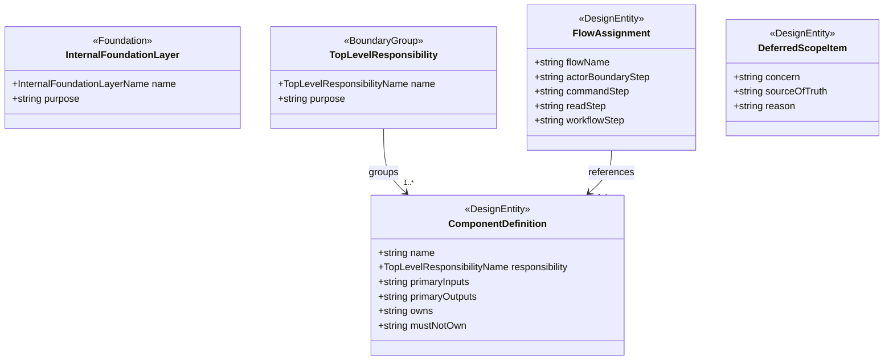

# Data Model: 機能別コンポーネント定義

## Component Boundary Overview

## Foundation Layer: Domain Core

**Purpose**: `Learner`、`VocabularyExpression`、`LearningState`、`Explanation`、
`VisualImage`、`Sense` など、既存の domain language と不変条件を保持する内側基盤。

| Field | Type | Cardinality | Description |
|-------|------|-------------|-------------|
| name | InternalFoundationLayerName | 1 | `domain-core` |
| purpose | string | 1 | 用語、不変条件、識別子命名、学習概念の境界維持 |

**Validation rules**:

- UI、auth/session、vendor adapter の詳細を直接保持してはならない
- component taxonomy の都合で frequency / sophistication / proficiency などの概念を統合してはならない

## Foundation Layer: Application Coordination

**Purpose**: domain を使って command intake、query read、async workflow、actor handoff を
つなぐ内側基盤。top-level 責務一覧とは別枠で、依存方向の基準だけを提供する。

| Field | Type | Cardinality | Description |
|-------|------|-------------|-------------|
| name | InternalFoundationLayerName | 1 | `application-coordination` |
| purpose | string | 1 | domain core と outer boundary / adapter の接続規則を保持する |

**Validation rules**:

- top-level responsibility の代替カテゴリとして使ってはならない
- workflow orchestration や actor handoff の存在を説明しても、vendor 固有 API や token detail を公開してはならない

## Entity: TopLevelResponsibility

**Purpose**: 外から見える component catalog の最上位分類を表す。

| Field | Type | Cardinality | Description |
|-------|------|-------------|-------------|
| name | TopLevelResponsibilityName | 1 | `Presentation` などの分類名 |
| purpose | string | 1 | その分類が何を担うか |

**Validation rules**:

- すべての component はちょうど 1 つの top-level responsibility に属さなければならない
- `Domain Core` と `Application Coordination` は top-level responsibility として扱ってはならない

## Entity: ComponentDefinition

**Purpose**: 1 つの component の名前、所属責務、入出力、ownership、非責務を表す。

| Field | Type | Cardinality | Description |
|-------|------|-------------|-------------|
| name | string | 1 | canonical component 名 |
| responsibility | TopLevelResponsibilityName | 1 | 所属する top-level responsibility |
| primaryInputs | string | 1 | 主要入力 |
| primaryOutputs | string | 1 | 主要出力 |
| owns | string | 1 | この component が主責務として持つもの |
| mustNotOwn | string | 1 | 持ってはいけない責務 |

**Validation rules**:

- `ComponentDefinition` は top-level responsibility をまたいではならない
- `Async Generation` 配下の component は request acceptance や direct UI rendering を own してはならない
- `External Adapters` 配下の component は domain や UI の判断責務を own してはならない

## Entity: FlowAssignment

**Purpose**: 主要 user flow に対して、どの component がどの工程を担うかを示す。

| Field | Type | Cardinality | Description |
|-------|------|-------------|-------------|
| flowName | string | 1 | 例: register vocabulary / read explanation / generate image |
| actorBoundaryStep | string | 0..1 | actor/auth boundary が関与する工程 |
| commandStep | string | 0..1 | request acceptance / validation / lookup の工程 |
| readStep | string | 0..1 | completed result / status / history の取得工程 |
| workflowStep | string | 0..1 | 長時間 workflow の工程 |

**Validation rules**:

- completed result の read は `Query Read` component でなければならない
- long-running execution を伴う工程は `Async Generation` component へ割り当てなければならない
- auth/session 詳細を要する工程は `Actor/Auth Boundary` から先へ raw token を渡してはならない

## Entity: DeferredScopeItem

**Purpose**: この feature が ownership を持たない責務と、その正本を示す。

| Field | Type | Cardinality | Description |
|-------|------|-------------|-------------|
| concern | string | 1 | deferred concern 名 |
| sourceOfTruth | string | 1 | 正本となる feature または文書 |
| reason | string | 1 | この feature で実装・再定義しない理由 |

**Validation rules**:

- deferred とした責務は、対応する source-of-truth を必ず持たなければならない
- in-scope component definition と deferred scope が同じ責務を二重定義してはならない

## Canonical Top-Level Responsibilities

| Responsibility | Purpose |
|----------------|---------|
| `Presentation` | ユーザー入力、completed result 表示、状態表示、interaction の起点を担う |
| `Actor/Auth Boundary` | auth/session 境界の出力を product 内へ正規化し、`Learner` 解決と actor handoff を担う |
| `Command Intake` | request acceptance、validation orchestration、duplicate lookup、workflow 起動要求の受付を担う |
| `Query Read` | completed result、履歴、status を取得し、presentation へ返す |
| `Async Generation` | long-running explanation / image workflow 実行を担う |
| `External Adapters` | validation、generation provider、asset storage/access、media access など外部依存接続を担う |

## Canonical Component Catalog

### Presentation

| Component | Owns | Must Not Own |
|-----------|------|--------------|
| `UI` | `VocabularyExpression` 登録入力、completed `Explanation` / `VisualImage` 表示、status 表示 | auth account lifecycle、workflow 実行、vendor API 呼び出し |

### Actor/Auth Boundary

| Component | Owns | Must Not Own |
|-----------|------|--------------|
| `Learner Identity Resolution` | 外部 identity から `Learner` 参照へ正規化する | 認証そのもの、session lifecycle 全体、query / workflow 実装 |
| `Actor Session Handoff` | auth/session 境界の結果を command/query 向け actor reference へ handoff する | token verification、provider credential 保持、学習データ更新 |

### Command Intake

| Component | Owns | Must Not Own |
|-----------|------|--------------|
| `Vocabulary Expression Registration Intake` | 登録要求受理の起点 | completed result 読み取り、workflow 実行本体 |
| `Vocabulary Expression Validation Policy` | 正規化と validation orchestration | vendor lexicon API 直結、UI rendering |
| `Registration Lookup` | 同一学習者内の重複確認 | auth/session、completed explanation/image 読み取り |
| `Explanation Generation Request Intake` | 解説生成要求受理 | explanation provider 呼び出し本体 |
| `Image Generation Request Intake` | 画像生成要求受理、optional `Sense` 入力の受理 | image provider 呼び出し本体、asset 保存本体 |

### Query Read

| Component | Owns | Must Not Own |
|-----------|------|--------------|
| `Explanation Reader` | completed `Explanation` と履歴取得 | workflow 起動、provider 呼び出し |
| `Visual Image Reader` | completed `VisualImage` と current image 解決 | asset 永続化、workflow 起動 |
| `Generation Status Reader` | explanation/image generation status の取得 | incomplete payload の公開 |
| `Pronunciation Media Reader` | 発音サンプル参照要求の app-facing read | media source 直結、credential 管理 |

### Async Generation

| Component | Owns | Must Not Own |
|-----------|------|--------------|
| `Explanation Generation Workflow` | `VocabularyExpression` から `Explanation` / `Sense` を生成する長時間処理 | request acceptance、UI 表示、completed result 読み出し API |
| `Image Generation Workflow` | completed `Explanation` と optional `Sense` から `VisualImage` を生成・保存する長時間処理 | request acceptance、UI 表示、asset access 解決 |

### External Adapters

| Component | Owns | Must Not Own |
|-----------|------|--------------|
| `Vocabulary Expression Validation Adapter` | 英語表現存在確認の外部接続 | validation policy の最終判断 |
| `Explanation Generation Provider Adapter` | explanation provider との接続 | request acceptance、read-side 表示 |
| `Image Generation Provider Adapter` | image provider との接続 | request acceptance、completed image 表示 |
| `Asset Storage Adapter` | 画像保存と stable reference 発行 | user-facing image read |
| `Asset Access Adapter` | stored image の再取得参照解決 | asset 永続化判断、workflow 起動 |
| `Pronunciation Media Adapter` | media source から音声参照を取得 | reader の app-facing contract 定義 |

## Flow Assignments

### Flow: Register Vocabulary Expression

| Step | Component |
|------|-----------|
| actor handoff | `Actor Session Handoff` |
| request acceptance | `Vocabulary Expression Registration Intake` |
| normalization / validation | `Vocabulary Expression Validation Policy` + `Vocabulary Expression Validation Adapter` |
| duplicate lookup | `Registration Lookup` |
| status / current result read | `Generation Status Reader` または `Explanation Reader` |

### Flow: Read Completed Explanation

| Step | Component |
|------|-----------|
| actor handoff | `Actor Session Handoff` |
| completed explanation read | `Explanation Reader` |
| status fallback | `Generation Status Reader` |
| pronunciation access | `Pronunciation Media Reader` + `Pronunciation Media Adapter` |

### Flow: Generate Image

| Step | Component |
|------|-----------|
| actor handoff | `Actor Session Handoff` |
| request acceptance | `Image Generation Request Intake` |
| workflow execution | `Image Generation Workflow` |
| provider call | `Image Generation Provider Adapter` |
| asset persist | `Asset Storage Adapter` |
| completed image read | `Visual Image Reader` + `Asset Access Adapter` |
| status read | `Generation Status Reader` |

## Deferred Scope Items

| Concern | Source of Truth | Reason |
|---------|-----------------|--------|
| auth/session implementation details | `specs/008-auth-session-design/` | 本 feature は actor/auth boundary の配置だけを扱い、credential、session lifecycle、provider policy の詳細は再定義しない |
| command acceptance semantics、retry / regenerate、dispatch rules | `specs/007-backend-command-design/` | component taxonomy だけを扱い、mutation contract 自体は 007 の正本に従う |
| query model schema / persistence implementation | future query feature, current `docs/external/adr.md` | query read component の存在を定義するが、具体 storage や schema は対象外 |
| vendor-specific adapter implementation | future implementation | adapter の責務境界だけを定義し、SDK や API 詳細は後続実装に委ねる |
| multiple current image / meaning gallery | follow-on scope | 009 では単一 `Explanation.currentImage` を前提にし、gallery 化は対象外 |

## Enumerations

### InternalFoundationLayerName

- `domain-core`
- `application-coordination`

### TopLevelResponsibilityName

- `presentation`
- `actor-auth-boundary`
- `command-intake`
- `query-read`
- `async-generation`
- `external-adapters`
