# Data Model: Subscription Component Boundaries

## Component Boundary Overview

```mermaid
classDiagram
    class SubscriptionBoundaryGroup {
        <<BoundaryGroup>>
        +SubscriptionBoundaryGroupName name
        +string purpose
    }

    class InnerPolicyComponent {
        <<InnerPolicy>>
        +string name
        +string purpose
        +string outputs
    }

    class SubscriptionComponentDefinition {
        <<DesignEntity>>
        +string name
        +SubscriptionBoundaryGroupName group
        +string primaryInputs
        +string primaryOutputs
        +string owns
        +string mustNotOwn
    }

    class AuthoritativeSubscriptionStateModel {
        <<StateModel>>
        +SubscriptionStateName state
        +bool keepsPaidEntitlement
        +bool allowsStatusDisplay
        +bool requiresReconciliation
    }

    class PurchaseStateModel {
        <<StateModel>>
        +PurchaseStateName state
        +bool allowsStatusDisplay
        +bool canUnlockPremium
        +bool requiresAdapterRetry
    }

    class AdapterResiliencePolicy {
        <<DesignEntity>>
        +string adapterName
        +string timeoutBehavior
        +string retryBehavior
        +string fallbackBehavior
    }

    class EntitlementMirror {
        <<DesignEntity>>
        +string actorReference
        +string entitlementSnapshot
        +string syncedAt
        +string source
    }

    class UsageQuotaPolicy {
        <<DesignEntity>>
        +string featureKey
        +string allowanceWindow
        +string exhaustionBehavior
    }

    class SubscriptionFlowAssignment {
        <<DesignEntity>>
        +string flowName
        +string intakeStep
        +string authorityStep
        +string gateStep
        +string readStep
    }

    class DeferredScopeItem {
        <<DesignEntity>>
        +string concern
        +string sourceOfTruth
        +string reason
    }

    SubscriptionBoundaryGroup --> "1..*" SubscriptionComponentDefinition : groups
    InnerPolicyComponent --> SubscriptionComponentDefinition : informs
    SubscriptionFlowAssignment --> "1..*" SubscriptionComponentDefinition : references
```

## Entity: SubscriptionBoundaryGroup

**Purpose**: 009 の component taxonomy を再利用しつつ、subscription 専用 component を
どの outer boundary に置くかを示す。

| Field | Type | Cardinality | Description |
|-------|------|-------------|-------------|
| name | SubscriptionBoundaryGroupName | 1 | boundary group 名 |
| purpose | string | 1 | その group が担う責務 |

**Validation rules**:

- すべての subscription component はちょうど 1 つの boundary group に属さなければならない
- `Domain Core` と `Application Coordination` は 009 と同様に内側基盤であり、この entity には含めない

## Entity: InnerPolicyComponent

**Purpose**: backend authority と app-facing 判定のあいだにある内側ポリシー部品を表す。

| Field | Type | Cardinality | Description |
|-------|------|-------------|-------------|
| name | string | 1 | canonical policy 名 |
| purpose | string | 1 | 何を決めるか |
| outputs | string | 1 | 後続 component へ渡す判断結果 |

**Validation rules**:

- `Entitlement Policy` は usage 消費判定を持ってはならない
- `Subscription Feature Gate` は purchase verification を持ってはならない
- `Usage Metering / Quota Gate` は subscription state の最終正本を持ってはならない

## Entity: SubscriptionComponentDefinition

**Purpose**: 1 つの subscription component の ownership と非責務を定義する。

| Field | Type | Cardinality | Description |
|-------|------|-------------|-------------|
| name | string | 1 | canonical component 名 |
| group | SubscriptionBoundaryGroupName | 1 | 所属 boundary group |
| primaryInputs | string | 1 | 主要入力 |
| primaryOutputs | string | 1 | 主要出力 |
| owns | string | 1 | 主責務 |
| mustNotOwn | string | 1 | 持ってはいけない責務 |

**Validation rules**:

- `Presentation` 配下の component は課金状態の正本を持ってはならない
- `Command Intake` 配下の component は paid unlock 判定を確定してはならない
- `Async Subscription Reconciliation` 配下の component は UI 表示責務を持ってはならない
- `External Adapters` 配下の component は product policy を最終決定してはならない

## Entity: AuthoritativeSubscriptionStateModel

**Purpose**: authoritative subscription state と unlock 影響を定義する。

| Field | Type | Cardinality | Description |
|-------|------|-------------|-------------|
| state | SubscriptionStateName | 1 | authoritative subscription state |
| keepsPaidEntitlement | bool | 1 | paid entitlement を維持するか |
| allowsStatusDisplay | bool | 1 | UI に状態表示してよいか |
| requiresReconciliation | bool | 1 | 追加の同期や照合が必要か |

**Validation rules**:

- `grace` は `keepsPaidEntitlement = true` でなければならない
- `pending-sync` は `keepsPaidEntitlement = false` でなければならない
- `revoked` は paid entitlement を維持してはならない

## Entity: PurchaseStateModel

**Purpose**: purchase / restore の受付と照合の進行状況を、authoritative subscription state と
分離して定義する。

| Field | Type | Cardinality | Description |
|-------|------|-------------|-------------|
| state | PurchaseStateName | 1 | canonical purchase state |
| allowsStatusDisplay | bool | 1 | UI に状態表示してよいか |
| canUnlockPremium | bool | 1 | premium unlock の根拠になりうるか |
| requiresAdapterRetry | bool | 1 | adapter retry または再同期が必要か |

**Validation rules**:

- `verified` 以外は `canUnlockPremium = false` でなければならない
- `submitted` と `verifying` は purchase artifact の処理中であり、status 表示だけを許可する
- `rejected` は purchase failure を示すが、authoritative subscription state の paid entitlement を直接決めてはならない

## Entity: EntitlementMirror

**Purpose**: app core と UI が参照する同期済み entitlement snapshot を表す。

| Field | Type | Cardinality | Description |
|-------|------|-------------|-------------|
| actorReference | string | 1 | actor / learner の参照 |
| entitlementSnapshot | string | 1 | backend authority から同期された権限集合 |
| syncedAt | string | 1 | 最終同期時刻 |
| source | string | 1 | authoritative backend source |

**Validation rules**:

- `EntitlementMirror` は backend authoritative state から導出される read-only view でなければならない
- local purchase cache や storefront callback だけで `EntitlementMirror` を確定してはならない

## Entity: AdapterResiliencePolicy

**Purpose**: 外部 adapter ごとの timeout、retry、fallback の扱いを定義する。

| Field | Type | Cardinality | Description |
|-------|------|-------------|-------------|
| adapterName | string | 1 | adapter 名 |
| timeoutBehavior | string | 1 | timeout 時に返す状態や扱い |
| retryBehavior | string | 1 | retry 条件と再試行主体 |
| fallbackBehavior | string | 1 | 障害時の代替動作 |

**Validation rules**:

- resilience policy は未確認 entitlement を unlock 根拠にしてはならない
- adapter failure 時の fallback は state 表示継続と retry / refresh 導線を含められるが、paid entitlement の付与を含めてはならない

## Entity: UsageQuotaPolicy

**Purpose**: entitlement と別に、利用量制限と枯渇時の扱いを定義する。

| Field | Type | Cardinality | Description |
|-------|------|-------------|-------------|
| featureKey | string | 1 | 制限対象機能 |
| allowanceWindow | string | 1 | 日次 / 月次 / trial などの集計窓 |
| exhaustionBehavior | string | 1 | 枯渇時に deny / wait / upsell のどれを返すか |

**Validation rules**:

- usage quota は paid entitlement の有無と独立に評価できなければならない
- free tier と paid tier の差分は quota policy または entitlement policy のどちらか一方にだけ持たせ、二重定義してはならない

## Entity: SubscriptionFlowAssignment

**Purpose**: 購入、復元、保護機能評価の各フローに component を割り当てる。

| Field | Type | Cardinality | Description |
|-------|------|-------------|-------------|
| flowName | string | 1 | flow 名 |
| intakeStep | string | 0..1 | command / intake step |
| authorityStep | string | 0..1 | verification / authoritative state 更新 step |
| gateStep | string | 0..1 | entitlement / quota / feature gate 判定 step |
| readStep | string | 0..1 | app-facing read / mirror step |

**Validation rules**:

- authoritative state 更新を伴う flow は `Async Subscription Reconciliation` を経由しなければならない
- UI 制御に使う結果は `Query Read` または synced mirror 経由でなければならない

## Entity: DeferredScopeItem

**Purpose**: 今回 ownership を持たない billing concern と、その正本を示す。

| Field | Type | Cardinality | Description |
|-------|------|-------------|-------------|
| concern | string | 1 | deferred concern 名 |
| sourceOfTruth | string | 1 | 正本となる feature または外部境界 |
| reason | string | 1 | 今回扱わない理由 |

**Validation rules**:

- deferred concern には必ず source-of-truth を付けなければならない
- in-scope component と deferred concern で同じ責務を二重定義してはならない

## Canonical Boundary Groups

| Group | Purpose |
|-------|---------|
| `Presentation` | paywall、subscription status、upsell、pending-sync 表示の UI を担う |
| `Actor/Auth Boundary` | auth/session 由来の actor reference を subscription 判断へ handoff する |
| `Command Intake` | purchase artifact 提出、復元要求、status refresh 要求の受付を担う |
| `Query Read` | subscription status、entitlement mirror、quota 状態、feature gate 結果を返す |
| `Async Subscription Reconciliation` | verification、notification ingest、authoritative state 更新を担う |
| `External Adapters` | storefront、verification API、notification source など外部接続を担う |

## Inner Policy Components

| Policy | Purpose | Outputs |
|--------|---------|---------|
| `Entitlement Policy` | authoritative subscription state と plan から解放権限を導出する | entitlement set |
| `Subscription Feature Gate` | entitlement と feature key から allow / limited / deny を返す | feature gate decision |
| `Usage Metering / Quota Gate` | 利用上限、無料枠、期間消費を評価する | quota decision |

## Canonical Component Catalog

### Presentation

| Component | Owns | Must Not Own |
|-----------|------|--------------|
| `Subscription Paywall UI` | plan 提示、購入導線起動、pending / revoked / expired の状態表示 | 課金確定、entitlement 確定、quota 消費 |
| `Subscription Status UI` | current subscription state、entitlement mirror、quota 残量の表示 | authoritative state 更新、verification |

### Actor/Auth Boundary

| Component | Owns | Must Not Own |
|-----------|------|--------------|
| `Actor Session Handoff` | auth/session から actor reference を subscription flow へ渡す | 認証そのもの、課金状態の正本、store credential 保持 |

### Command Intake

| Component | Owns | Must Not Own |
|-----------|------|--------------|
| `Purchase Result Intake` | storefront 完了後の purchase artifact 提出を受け付ける | purchase verification 本体、unlock 確定 |
| `Restore Purchase Intake` | restore 要求の受付 | store API detail、entitlement 確定 |
| `Subscription Status Refresh Intake` | 同期再実行や cross-device refresh の起点 | authoritative state の読み出し API 直結 |

### Query Read

| Component | Owns | Must Not Own |
|-----------|------|--------------|
| `Subscription Status Reader` | authoritative subscription state を app-facing status に整形して返す | verification 実行 |
| `Entitlement Reader` | synced entitlement mirror を返す | purchase artifact 受付、quota 消費 |
| `Usage Allowance Reader` | usage 残量と quota 状態を返す | entitlement 付与 |
| `Subscription Feature Gate Reader` | app core / UI 向けの allow / limited / deny 判定を返す | purchase verification、storefront 操作 |

### Async Subscription Reconciliation

| Component | Owns | Must Not Own |
|-----------|------|--------------|
| `Purchase Verification Workflow` | purchase artifact を検証し authoritative subscription state を更新する | UI 表示、pricing catalog 提供 |
| `Store Notification Reconciliation Workflow` | server notification を取り込み authoritative state / entitlement を再計算する | storefront 起動、paywall rendering |

### External Adapters

| Component | Owns | Must Not Own |
|-----------|------|--------------|
| `Mobile Storefront Adapter` | App Store / Google Play の購入開始と restore 接続 | entitlement 確定、quota 判定 |
| `Purchase Verification Adapter` | receipt / token / purchase artifact の検証接続 | product policy 決定 |
| `Store Notification Adapter` | store notification の受信と正規化 | authoritative entitlement の最終決定 |

## Authoritative Subscription State Effects

| State | Paid Entitlement | UI Status | Notes |
|-------|------------------|-----------|-------|
| `active` | 維持する | 表示する | 通常の有料状態 |
| `grace` | 維持する | 表示する | 一時継続状態。paid entitlement は維持 |
| `expired` | 維持しない | 表示する | paid entitlement 停止 |
| `pending-sync` | 維持しない | 表示する | 反映待ち。unlock 判定に使わない |
| `revoked` | 維持しない | 表示する | 返金、取り消し、強制失効など |

## Purchase State Effects

| State | UI Status | Premium Unlock | Notes |
|-------|-----------|----------------|-------|
| `initiated` | 表示してよい | 不可 | storefront 開始前後の初期状態 |
| `submitted` | 表示してよい | 不可 | purchase artifact 提出済み |
| `verifying` | 表示してよい | 不可 | verification 実行中 |
| `verified` | 表示してよい | 可 | authoritative update 成功後にのみ unlock 根拠になりうる |
| `rejected` | 表示してよい | 不可 | verification failure または拒否 |

## Adapter Resilience Matrix

| Adapter | Timeout Behavior | Retry Behavior | Fallback Behavior |
|---------|------------------|----------------|-------------------|
| `Mobile Storefront Adapter` | purchase state を `initiated` または `submitted` のまま保持し、status 表示を継続する | user-driven retry または restore の再実行を許可する | paywall と status UI に再試行導線を出し、premium unlock は行わない |
| `Purchase Verification Adapter` | purchase state を `verifying` に留める | workflow が retry し、一定回数後は refresh を要求する | `pending-sync` と processing status を返し、entitlement mirror は更新しない |
| `Store Notification Adapter` | authoritative subscription state の更新を保留する | reconciliation workflow が再取得を試みる | 既存 mirror のまま status を表示しつつ manual refresh を許可する |

## Flow Assignments

### Flow: Complete Purchase

| Step | Component |
|------|-----------|
| actor handoff | `Actor Session Handoff` |
| purchase state progression | `initiated` -> `submitted` -> `verifying` -> `verified` or `rejected` |
| purchase submission | `Purchase Result Intake` |
| verification | `Purchase Verification Workflow` + `Purchase Verification Adapter` |
| authoritative update | `Purchase Verification Workflow` |
| entitlement derivation | `Entitlement Policy` |
| gate evaluation | `Subscription Feature Gate` + `Usage Metering / Quota Gate` |
| app-facing read | `Subscription Status Reader` + `Entitlement Reader` + `Subscription Feature Gate Reader` |

### Flow: Restore Purchase

| Step | Component |
|------|-----------|
| actor handoff | `Actor Session Handoff` |
| purchase state progression | `initiated` -> `submitted` -> `verifying` -> `verified` or `rejected` |
| restore request | `Restore Purchase Intake` + `Mobile Storefront Adapter` |
| verification | `Purchase Verification Workflow` + `Purchase Verification Adapter` |
| authoritative update | `Purchase Verification Workflow` |
| app-facing read | `Subscription Status Reader` + `Entitlement Reader` |

### Flow: Evaluate Protected Feature

| Step | Component |
|------|-----------|
| actor handoff | `Actor Session Handoff` |
| status refresh | `Subscription Status Refresh Intake` |
| entitlement read | `Entitlement Reader` |
| quota read | `Usage Allowance Reader` |
| gate decision | `Subscription Feature Gate Reader` |
| upsell / status display | `Subscription Paywall UI` or `Subscription Status UI` |

## Deferred Scope Items

| Concern | Source of Truth | Reason |
|---------|-----------------|--------|
| auth/account/session lifecycle | `/Users/lihs/workspace/vocastock/specs/008-auth-session-design/` | actor handoff 接点だけを使い、認証詳細は再定義しない |
| protected feature command semantics | `/Users/lihs/workspace/vocastock/specs/007-backend-command-design/` | billing gate は前段判定のみを扱い、command rule 自体は 007 を正本とする |
| product-wide component taxonomy | `/Users/lihs/workspace/vocastock/specs/009-component-boundaries/` | 010 は subscription-specific package であり 009 を置き換えない |
| pricing catalog、tax、refund policy | mobile storefront / external business policy | billing policy detail は architecture boundary feature の対象外 |
| vendor SDK selection / store-specific setup | future implementation | adapter の存在だけを定義し、SDK 詳細は実装フェーズへ委ねる |

## Enumerations

### SubscriptionBoundaryGroupName

- `presentation`
- `actor-auth-boundary`
- `command-intake`
- `query-read`
- `async-subscription-reconciliation`
- `external-adapters`

### SubscriptionStateName

- `active`
- `grace`
- `expired`
- `pending-sync`
- `revoked`

### PurchaseStateName

- `initiated`
- `submitted`
- `verifying`
- `verified`
- `rejected`
