# Data Model: API / Command I/O 設計

## Command I/O Overview

```mermaid
classDiagram
    class CommandRequestEnvelope {
        <<DesignEntity>>
        +CommandName command
        +ActorHandoffInput actor
        +IdempotencyKey idempotencyKey
        +CommandRequestBody body
    }

    class ActorHandoffInput {
        <<BoundaryEntity>>
        +ActorReference actor
        +AuthAccountIdentifier authAccount
        +SessionIdentifier session
        +HandoffSessionState sessionState
    }

    class RegisterVocabularyExpressionRequest {
        <<CommandBody>>
        +VocabularyExpressionText text
        +bool startExplanation
    }

    class RequestExplanationGenerationRequest {
        <<CommandBody>>
        +VocabularyExpressionIdentifier vocabularyExpression
        +ExplanationRequestReason reason
    }

    class RequestImageGenerationRequest {
        <<CommandBody>>
        +ExplanationIdentifier explanation
        +SenseIdentifier sense
        +ImageRequestReason reason
    }

    class RetryGenerationRequest {
        <<CommandBody>>
        +RetryTargetKind targetKind
        +CommandTargetReference target
        +RetryMode mode
        +RetryRequestReason reason
    }

    class CommandResponseEnvelope {
        <<DesignEntity>>
        +AcceptanceOutcome acceptance
        +CommandTargetReference target
        +StateSummary state
        +UserFacingMessage message
        +bool replayedByIdempotency
        +DuplicateReuseResult duplicateReuse
    }

    class CommandError {
        <<DesignEntity>>
        +CommandErrorCode code
        +UserFacingMessage message
        +InternalDetailClass detail
        +bool retryable
        +CommandTargetReference target
        +StateSummary state
    }

    class CommandTargetReference {
        <<DesignEntity>>
        +VocabularyExpressionIdentifier vocabularyExpression
        +ExplanationIdentifier explanation
        +SenseIdentifier sense
    }

    class StateSummary {
        <<DesignEntity>>
        +RegistrationStatus registration
        +ExplanationGenerationStatus explanation
        +ImageGenerationStatus image
        +SubscriptionStateName subscriptionDisplay
        +bool premiumAccessConfirmed
    }

    class DuplicateReuseResult {
        <<DesignEntity>>
        +VocabularyExpressionIdentifier vocabularyExpression
        +StateSummary state
        +DuplicateRestartDecision restartDecision
        +RestartConditionSummary restartCondition
    }

    class CommandIdempotencyRule {
        <<DesignEntity>>
        +CommandName command
        +string sameRequestRule
        +string conflictRule
        +string replayBehavior
    }

    CommandRequestEnvelope --> ActorHandoffInput : includes
    CommandRequestEnvelope --> RegisterVocabularyExpressionRequest : body
    CommandRequestEnvelope --> RequestExplanationGenerationRequest : body
    CommandRequestEnvelope --> RequestImageGenerationRequest : body
    CommandRequestEnvelope --> RetryGenerationRequest : body
    CommandResponseEnvelope --> CommandTargetReference : returns
    CommandResponseEnvelope --> StateSummary : returns
    CommandResponseEnvelope --> DuplicateReuseResult : mayReturn
    RetryGenerationRequest --> CommandTargetReference : references
```

## Design Entity: CommandRequestEnvelope

**Purpose**: すべての command request に共通する envelope を表す。

| Field | Type | Cardinality | Description |
|-------|------|-------------|-------------|
| command | CommandName | 1 | canonical command 名 |
| actor | ActorHandoffInput | 1 | completed auth/session handoff |
| idempotencyKey | IdempotencyKey | 1 | 同一業務要求を表す再送識別子 |
| body | CommandRequestBody | 1 | command 固有 body |

**Validation rules**:

- `command` と `body` の組み合わせは 1 対 1 でなければならない
- `actor` は unresolved state や raw credential を含んではならない
- `idempotencyKey` は actor 単位の state change request ごとに必須である
- 同一 `idempotencyKey` の replay 判定は、同じ `command`、同じ actor、同じ正規化 body を前提に行う

## Boundary Entity: ActorHandoffInput

**Purpose**: 008 の completed output から command boundary へ渡す認証済み actor 入力を表す。

| Field | Type | Cardinality | Description |
|-------|------|-------------|-------------|
| actor | ActorReference | 1 | command が利用する正規化済み actor 参照 |
| authAccount | AuthAccountIdentifier | 1 | upstream auth account 参照 |
| session | SessionIdentifier | 1 | upstream session 参照 |
| sessionState | HandoffSessionState | 1 | active か rechecked-active か |

**Validation rules**:

- `actor` は provider token、Firebase ID token、refresh token、password を含んではならない
- `authAccount` と `session` は completed handoff の最小 shape として必須である
- `sessionState` は `active` または `rechecked-active` に限る
- `sessionState` が completed 条件を満たさない場合は command request を構築してはならない

## Command Body: RegisterVocabularyExpressionRequest

**Purpose**: 学習者所有の新規登録 request を表す。

| Field | Type | Cardinality | Description |
|-------|------|-------------|-------------|
| text | VocabularyExpressionText | 1 | 登録対象表現 |
| startExplanation | boolean | 0..1 | omitted の場合は `true` とみなす |

**Validation rules**:

- `startExplanation = false` を許可するのはこの body だけである
- duplicate registration 判定は正規化済み表現を用いる

## Command Body: RequestExplanationGenerationRequest

**Purpose**: 既存 `VocabularyExpression` に対する解説生成開始または再生成 request を表す。

| Field | Type | Cardinality | Description |
|-------|------|-------------|-------------|
| vocabularyExpression | VocabularyExpressionIdentifier | 1 | 対象登録表現 |
| reason | ExplanationRequestReason | 1 | 初回生成か再生成かの意図 |

**Validation rules**:

- `vocabularyExpression` は actor 所有対象でなければならない
- completed explanation payload は request body に含めてはならない

## Command Body: RequestImageGenerationRequest

**Purpose**: 完了済み `Explanation` に対する画像生成 request を表す。

| Field | Type | Cardinality | Description |
|-------|------|-------------|-------------|
| explanation | ExplanationIdentifier | 1 | 主 target |
| sense | SenseIdentifier | 0..1 | 特定意味を描写したい場合の補助参照 |
| reason | ImageRequestReason | 1 | 初回生成か再生成かの意図 |

**Validation rules**:

- `explanation` は完了済みでなければならない
- `sense` を指定する場合は対象 `Explanation` 配下の `Sense` でなければならない
- `VisualImage` や image payload 本体を request body に含めてはならない

## Command Body: RetryGenerationRequest

**Purpose**: failed generation の retry または regenerate request を表す。

| Field | Type | Cardinality | Description |
|-------|------|-------------|-------------|
| targetKind | RetryTargetKind | 1 | explanation か image か |
| target | CommandTargetReference | 1 | 再試行対象参照 |
| mode | RetryMode | 1 | retry か regenerate か |
| reason | RetryRequestReason | 0..1 | 補足理由 |

**Validation rules**:

- `targetKind = explanation` の場合は `target.vocabularyExpression` が必須で、`target.explanation` は持たない
- `targetKind = image` の場合は `target.explanation` が必須で、`target.sense` は任意である
- `mode = retry` は failed 対象、`mode = regenerate` は succeeded 対象を前提とする
- retry request 自体は completed payload を含んではならない

## Design Entity: CommandTargetReference

**Purpose**: request / response の両方で使う target 参照の共通表現を表す。

| Field | Type | Cardinality | Description |
|-------|------|-------------|-------------|
| vocabularyExpression | VocabularyExpressionIdentifier | 0..1 | 登録対象参照 |
| explanation | ExplanationIdentifier | 0..1 | 解説 target 参照 |
| sense | SenseIdentifier | 0..1 | 特定意味参照 |

**Validation rules**:

- すべての field を空にしてはならない
- `sense` は単独では存在できず、`explanation` と組で使う
- response の target 参照は completed payload ではなく identifier だけを返す

## Design Entity: CommandResponseEnvelope

**Purpose**: accepted または reused-existing の success response を表す。

| Field | Type | Cardinality | Description |
|-------|------|-------------|-------------|
| acceptance | AcceptanceOutcome | 1 | `accepted` または `reused-existing` |
| target | CommandTargetReference | 1 | command が返す対象参照 |
| state | StateSummary | 1 | client に返してよい状態要約 |
| message | UserFacingMessage | 1 | user-facing な説明 |
| replayedByIdempotency | boolean | 1 | same-request replay で再利用したか |
| duplicateReuse | DuplicateReuseResult | 0..1 | duplicate registration の補足 |

**Validation rules**:

- success response は未完了成果物本文や image URL を含んではならない
- `acceptance = reused-existing` の場合は `duplicateReuse` または replay 情報が必要である
- `replayedByIdempotency = true` の場合、新しい dispatch は行ってはならない

## Design Entity: CommandError

**Purpose**: command failure / rejection の canonical error 表現を表す。

| Field | Type | Cardinality | Description |
|-------|------|-------------|-------------|
| code | CommandErrorCode | 1 | canonical error code |
| message | UserFacingMessage | 1 | client に返す必須 message |
| detail | InternalDetailClass | 1 | internal-only detail の分類 |
| retryable | boolean | 1 | 再送余地があるか |
| target | CommandTargetReference | 0..1 | 対象参照 |
| state | StateSummary | 0..1 | 返してよい範囲の状態要約 |

**Validation rules**:

- `detail` は client response 本体へ露出してはならない
- `code = dispatch-failed` は `retryable = true` を許可できるが、success envelope と同時に返してはならない
- `code = idempotency-conflict` は replay ではなく rejection を意味する

## Design Entity: StateSummary

**Purpose**: command response に含めてよい最小限の状態要約を表す。

| Field | Type | Cardinality | Description |
|-------|------|-------------|-------------|
| registration | RegistrationStatus | 0..1 | 登録状態 |
| explanation | ExplanationGenerationStatus | 0..1 | 解説生成状態 |
| image | ImageGenerationStatus | 0..1 | 画像生成状態 |
| subscriptionDisplay | SubscriptionStateName | 0..1 | 状態表示用 subscription status |
| premiumAccessConfirmed | boolean | 0..1 | confirmed unlock を示す補助値 |

**Validation rules**:

- `registration`、`explanation`、`image` は別概念として混同してはならない
- `subscriptionDisplay = pending-sync` の場合、`premiumAccessConfirmed = true` にしてはならない
- state summary は provider 名、dispatch detail、stack trace を含んではならない

## Design Entity: DuplicateReuseResult

**Purpose**: duplicate registration 時の既存対象再利用結果を表す。

| Field | Type | Cardinality | Description |
|-------|------|-------------|-------------|
| vocabularyExpression | VocabularyExpressionIdentifier | 1 | 既存登録対象 |
| state | StateSummary | 1 | 現在状態の要約 |
| restartDecision | DuplicateRestartDecision | 1 | 再開するか否か |
| restartCondition | RestartConditionSummary | 1 | 判定理由の要約 |

**Validation rules**:

- `restartDecision = restart-accepted` は既存状態が `not-started` または `failed` かつ `startExplanation != false` の場合に限る
- duplicate reuse は新規 `VocabularyExpression` 作成を伴ってはならない

## Design Entity: CommandIdempotencyRule

**Purpose**: same-request replay と conflict rejection の規則を表す。

| Field | Type | Cardinality | Description |
|-------|------|-------------|-------------|
| command | CommandName | 1 | 対象 command |
| sameRequestRule | string | 1 | 同一要求とみなす条件 |
| conflictRule | string | 1 | conflict とみなす条件 |
| replayBehavior | string | 1 | replay 時の返却方針 |

**Validation rules**:

- 同じ `idempotencyKey` でも actor が異なる場合は same-request とみなしてはならない
- same-request replay は以前の accepted / reused-existing 結果または現在状態を返す
- conflict は `CommandError.code = idempotency-conflict` を返す

## Enumerations

### CommandName

- `registerVocabularyExpression`
- `requestExplanationGeneration`
- `requestImageGeneration`
- `retryGeneration`

### AcceptanceOutcome

- `accepted`
- `reused-existing`

### HandoffSessionState

- `active`
- `rechecked-active`

### DuplicateRestartDecision

- `restart-accepted`
- `no-restart`

### RetryTargetKind

- `explanation`
- `image`

### RetryMode

- `retry`
- `regenerate`

### CommandErrorCode

- `validation-failed`
- `ownership-mismatch`
- `target-missing`
- `target-not-ready`
- `idempotency-conflict`
- `dispatch-failed`
- `internal-failure`
