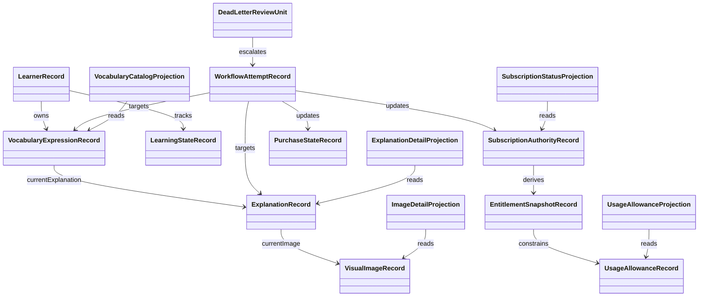

# Data Model: 永続化 / Read Model と非同期 Workflow 設計

## Overview

## Authoritative Persistence Allocations

### LearnerRecord

**Purpose**: `Learner` 集約の authoritative write-side 正本を保持する。

| Field | Type | Cardinality | Description |
|-------|------|-------------|-------------|
| identifier | LearnerIdentifier | 1 | 学習者識別子 |
| authenticationSubject | AuthenticationSubject | 1 | 外部 identity 参照 |
| timeline | Timeline | 1 | 作成・更新時刻 |

**Uniqueness / Indexes**:

- `identifier` は主キー
- `authenticationSubject` は一意 index

### VocabularyExpressionRecord

**Purpose**: `VocabularyExpression` 集約の authoritative write-side 正本を保持する。

| Field | Type | Cardinality | Description |
|-------|------|-------------|-------------|
| identifier | VocabularyExpressionIdentifier | 1 | 登録対象識別子 |
| learner | LearnerIdentifier | 1 | 所有学習者 |
| text | VocabularyExpressionText | 1 | 登録表現 |
| normalizedText | NormalizedVocabularyExpressionText | 1 | 重複判定用表現 |
| kind | VocabularyExpressionKind | 1 | 単語か連語か |
| registrationStatus | RegistrationStatus | 1 | 登録状態 |
| explanationGeneration | ExplanationGenerationStatus | 1 | 解説生成状態 |
| currentExplanation | ExplanationIdentifier | 0..1 | 現在表示する完了済み解説 |
| timeline | Timeline | 1 | 作成・更新時刻 |

**Uniqueness / Indexes**:

- `identifier` は主キー
- `learner + normalizedText` は一意 index
- `learner + registrationStatus`
- `learner + explanationGeneration`

### LearningStateRecord

**Purpose**: `LearningState` 集約の authoritative write-side 正本を保持する。

| Field | Type | Cardinality | Description |
|-------|------|-------------|-------------|
| identifier | LearningStateIdentifier | 1 | `learner + vocabularyExpression` 複合識別子 |
| proficiency | Proficiency | 1 | 習熟度 |
| timeline | Timeline | 1 | 作成・更新時刻 |

**Uniqueness / Indexes**:

- `identifier` は主キー
- `identifier.learner + proficiency`

### ExplanationRecord

**Purpose**: `Explanation` 集約の authoritative write-side 正本を保持する。

| Field | Type | Cardinality | Description |
|-------|------|-------------|-------------|
| identifier | ExplanationIdentifier | 1 | 解説識別子 |
| vocabularyExpression | VocabularyExpressionIdentifier | 1 | 元の登録対象 |
| senses | Sense の一覧 | 1..5 | 意味単位の本体 |
| pronunciation | Pronunciation | 1 | 発音情報 |
| frequency | Frequency | 1 | 頻出度 |
| sophistication | Sophistication | 1 | 知的度 |
| etymology | Etymology | 1 | 語源 |
| similarities | SimilarExpression の一覧 | 1..5 | 類似表現 |
| imageGeneration | ImageGenerationStatus | 1 | 画像生成状態 |
| currentImage | VisualImageIdentifier | 0..1 | 現在表示する完了済み画像 |
| timeline | Timeline | 1 | 作成・更新時刻 |

**Uniqueness / Indexes**:

- `identifier` は主キー
- `vocabularyExpression + timeline.updatedAt`
- `vocabularyExpression + imageGeneration`

### VisualImageRecord

**Purpose**: `VisualImage` 集約の authoritative write-side 正本を保持する。

| Field | Type | Cardinality | Description |
|-------|------|-------------|-------------|
| identifier | VisualImageIdentifier | 1 | 画像識別子 |
| explanation | ExplanationIdentifier | 1 | 生成元解説 |
| sense | SenseIdentifier | 0..1 | 描写対象意味 |
| previousImage | VisualImageIdentifier | 0..1 | 同一 lineage 上の直前画像 |
| storageReference | StorageReference | 1 | 永続化アセット参照 |
| timeline | Timeline | 1 | 作成・更新時刻 |

**Uniqueness / Indexes**:

- `identifier` は主キー
- `explanation + timeline.updatedAt`
- `explanation + sense + timeline.updatedAt`
- `previousImage`

### SubscriptionAuthorityRecord

**Purpose**: authoritative subscription state の最終正本を保持する。

| Field | Type | Cardinality | Description |
|-------|------|-------------|-------------|
| actor | ActorReferenceIdentifier | 1 | 対象 actor |
| subscriptionState | SubscriptionStateName | 1 | `active` / `grace` / `expired` / `pending-sync` / `revoked` |
| planKey | SubscriptionPlanKey | 0..1 | 有効 plan |
| effectiveWindow | EntitlementWindow | 0..1 | entitlement 有効期間 |
| sourceVersion | SubscriptionSourceVersion | 1 | 最後に authoritative 更新した入力の版 |
| timeline | Timeline | 1 | 作成・更新時刻 |

**Uniqueness / Indexes**:

- `actor` は一意 index
- `subscriptionState + timeline.updatedAt`

### PurchaseStateRecord

**Purpose**: purchase / restore 受付と検証進行の canonical purchase state を保持する。

| Field | Type | Cardinality | Description |
|-------|------|-------------|-------------|
| storePurchase | StorePurchaseReference | 1 | store 側の stable purchase 参照 |
| authAccount | AuthAccountIdentifier | 1 | 購入に紐づく auth account |
| purchaseState | PurchaseStateName | 1 | `initiated` / `submitted` / `verifying` / `verified` / `rejected` |
| product | StoreProductKey | 1 | 対象商品 |
| latestVerificationAttempt | WorkflowAttemptIdentifier | 0..1 | 最新 verification 試行 |
| timeline | Timeline | 1 | 作成・更新時刻 |

**Uniqueness / Indexes**:

- `storePurchase` は一意 index
- `authAccount + purchaseState`
- `product + purchaseState`

### EntitlementSnapshotRecord

**Purpose**: authoritative subscription state から導出した app-facing entitlement の正本スナップショットを保持する。

| Field | Type | Cardinality | Description |
|-------|------|-------------|-------------|
| actor | ActorReferenceIdentifier | 1 | 対象 actor |
| entitlementSet | EntitlementKey の一覧 | 1..n | 許可された entitlement |
| sourceSubscriptionState | SubscriptionStateName | 1 | 導出元 state |
| sourceVersion | SubscriptionSourceVersion | 1 | 導出元版 |
| timeline | Timeline | 1 | 作成・更新時刻 |

**Uniqueness / Indexes**:

- `actor` は一意 index
- `sourceSubscriptionState + timeline.updatedAt`

### UsageAllowanceRecord

**Purpose**: 利用回数や無料枠の残量を authoritative write-side として保持する。

| Field | Type | Cardinality | Description |
|-------|------|-------------|-------------|
| actor | ActorReferenceIdentifier | 1 | 対象 actor |
| feature | FeatureGateKey | 1 | 対象機能 |
| allowanceWindow | AllowanceWindow | 1 | 集計期間 |
| consumedCount | NonNegativeInteger | 1 | 消費量 |
| limitCount | NonNegativeInteger | 1 | 上限 |
| timeline | Timeline | 1 | 作成・更新時刻 |

**Uniqueness / Indexes**:

- `actor + feature + allowanceWindow` は一意 index
- `feature + allowanceWindow`

### IdempotencyRecord

**Purpose**: 011 で定義した actor-scoped idempotency 判定の保存先を表す。

| Field | Type | Cardinality | Description |
|-------|------|-------------|-------------|
| actor | ActorReferenceIdentifier | 1 | 対象 actor |
| idempotencyKey | IdempotencyKey | 1 | 再送識別子 |
| command | CommandName | 1 | 対象 command |
| normalizedRequestHash | NormalizedRequestFingerprint | 1 | 同一要求判定用 |
| storedOutcome | AcceptanceOutcome or CommandErrorCode | 1 | 再利用対象結果 |
| timeline | Timeline | 1 | 作成・更新時刻 |

**Uniqueness / Indexes**:

- `actor + idempotencyKey` は一意 index
- `command + timeline.updatedAt`

### WorkflowAttemptRecord

**Purpose**: explanation / image / purchase / restore / notification workflow の runtime state を保持する。

| Field | Type | Cardinality | Description |
|-------|------|-------------|-------------|
| identifier | WorkflowAttemptIdentifier | 1 | 試行識別子 |
| workflowKind | WorkflowKind | 1 | `explanation-generation` など |
| targetReference | WorkflowTargetReference | 1 | 対象 aggregate / state |
| runtimeState | WorkflowRuntimeState | 1 | queued / running / retry-scheduled / timed-out / succeeded / failed-final / dead-lettered など |
| retryCount | NonNegativeInteger | 1 | 実行済み retry 回数 |
| timeoutAt | Timestamp | 0..1 | timeout 判定時刻 |
| nextRetryAt | Timestamp | 0..1 | 次回 retry 予定 |
| failureClass | WorkflowFailureClass | 0..1 | 失敗分類 |
| timeline | Timeline | 1 | 作成・更新時刻 |

**Uniqueness / Indexes**:

- `identifier` は主キー
- `workflowKind + targetReference + timeline.updatedAt`
- `workflowKind + runtimeState`
- 同一 `workflowKind + targetReference` で active な attempt は 0..1 件

### DeadLetterReviewUnit

**Purpose**: retry exhaustion 後に operator review が必要な終端を保持する。

| Field | Type | Cardinality | Description |
|-------|------|-------------|-------------|
| identifier | DeadLetterReviewIdentifier | 1 | review 単位識別子 |
| workflowAttempt | WorkflowAttemptIdentifier | 1 | 対象 attempt |
| targetReference | WorkflowTargetReference | 1 | 対象 aggregate / state |
| failureClass | WorkflowFailureClass | 1 | review 理由 |
| reviewStatus | ReviewStatus | 1 | `pending-review` / `resolved` |
| timeline | Timeline | 1 | 作成・更新時刻 |

**Uniqueness / Indexes**:

- `identifier` は主キー
- `reviewStatus + timeline.updatedAt`
- `workflowAttempt` は一意 index

## Read Projections

### VocabularyCatalogProjection

**Purpose**: 学習者が所有する登録一覧と状態要約を app-facing に返す。

**Composed from**:

- `VocabularyExpressionRecord`
- `LearningStateRecord`
- 最新の `WorkflowAttemptRecord` (`explanation-generation`)

**Visibility rules**:

- `currentExplanation` がない場合は status-only を返す
- duplicate registration は projection を新規作成せず既存 projection を再利用する

### ExplanationDetailProjection

**Purpose**: completed `Explanation` と generation status を app-facing に返す。

**Composed from**:

- `VocabularyExpressionRecord.currentExplanation`
- `ExplanationRecord`
- 最新の `WorkflowAttemptRecord` (`explanation-generation`)

**Visibility rules**:

- completed `ExplanationRecord` がある場合だけ本文を返す
- `retry-scheduled` / `timed-out` / `failed-final` / `dead-lettered` は status-only に正規化する

### ImageDetailProjection

**Purpose**: completed `VisualImage` と image generation status を app-facing に返す。

**Composed from**:

- `ExplanationRecord.currentImage`
- `VisualImageRecord`
- 最新の `WorkflowAttemptRecord` (`image-generation`)

**Visibility rules**:

- `currentImage` がある場合だけ画像参照を返す
- image 保存失敗などの partial success では completed image を切り替えない

### SubscriptionStatusProjection

**Purpose**: subscription state、purchase state の status-only 表示、entitlement mirror を app-facing に返す。

**Composed from**:

- `SubscriptionAuthorityRecord`
- `PurchaseStateRecord`
- `EntitlementSnapshotRecord`

**Visibility rules**:

- `pending-sync` は表示できるが premium unlock 確定情報として扱わない
- `grace` は paid entitlement 維持として表示できる

### UsageAllowanceProjection

**Purpose**: quota / free-tier 利用状況を app-facing に返す。

**Composed from**:

- `UsageAllowanceRecord`
- `EntitlementSnapshotRecord`

**Visibility rules**:

- allowance は entitlement と並べて見せてもよいが、導出根拠を混同してはならない

## Workflow State Mapping

| Runtime State | User-facing Projection | Meaning |
|---------------|------------------------|---------|
| `queued` | `pending` | 受付済みだが実行前 |
| `running` | `running` | 実行中 |
| `retry-scheduled` | `pending` または `running` | 自動再試行待ち |
| `timed-out` | `failed` | timeout により新しい completed result は作られない |
| `succeeded` | `succeeded` | completed result と current pointer が更新済み |
| `failed-final` | `failed` | 自動 retry を打ち切った失敗 |
| `dead-lettered` | `failed` | operator review 待ち終端 |

## Ordering Rules

- explanation / image workflow では、新しい completed aggregate の保存が成功した後に `currentExplanation` / `currentImage` を切り替える
- image asset 保存が失敗した場合、`VisualImageRecord` と `currentImage` を確定してはならない
- purchase verification では `PurchaseStateRecord.purchaseState = verified` が確定するまで authoritative subscription state を paid へ進めてはならない
- `EntitlementSnapshotRecord` は `SubscriptionAuthorityRecord` の更新後に再計算する
- read projection は authoritative write の後で更新され、先行して completed と見せてはならない
