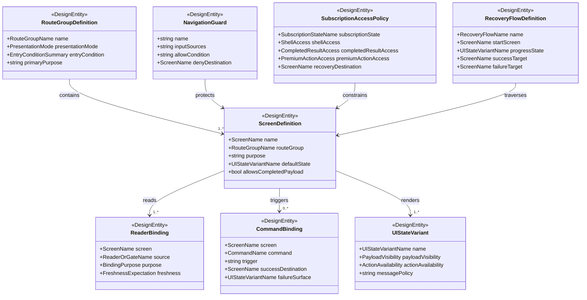

# Data Model: Flutter 画面遷移 / UI 状態設計

## UI State Design Overview

## Entity: RouteGroupDefinition

**Purpose**: 最上位の route group と presentation mode を定義する。

| Field | Type | Cardinality | Description |
|-------|------|-------------|-------------|
| name | RouteGroupName | 1 | `Auth`、`AppShell`、`Paywall`、`Restricted` のいずれか |
| presentationMode | PresentationMode | 1 | full-screen か shell-contained か |
| entryCondition | EntryConditionSummary | 1 | この route group に入る条件 |
| primaryPurpose | string | 1 | group が担う責務 |

**Validation rules**:

- `Auth`、`Paywall`、`Restricted` は `presentationMode = full-screen` でなければならない
- `AppShell` は login 完了かつ actor handoff 完了後にしか入れない
- 1 つの screen はちょうど 1 つの route group に属さなければならない

## Entity: ScreenDefinition

**Purpose**: 画面の目的、属する route group、許可される payload 公開範囲を定義する。

| Field | Type | Cardinality | Description |
|-------|------|-------------|-------------|
| name | ScreenName | 1 | canonical な画面名 |
| routeGroup | RouteGroupName | 1 | 所属 route group |
| purpose | string | 1 | screen の役割 |
| defaultState | UIStateVariantName | 1 | 初期表示 state |
| allowsCompletedPayload | boolean | 1 | completed payload の本文 / 画像を表示してよいか |

**Validation rules**:

- `VocabularyExpression Detail` は `allowsCompletedPayload = false` でなければならない
- completed explanation detail と completed image detail だけが result payload 本体を表示できる
- paywall と restricted access 画面は generation payload を表示してはならない

## Entity: NavigationGuard

**Purpose**: route group または screen へ入るための判定条件を定義する。

| Field | Type | Cardinality | Description |
|-------|------|-------------|-------------|
| name | string | 1 | guard 名 |
| inputSources | string | 1 | 参照する reader / gate / handoff |
| allowCondition | string | 1 | 通過条件 |
| denyDestination | ScreenName | 1 | 条件不成立時の遷移先 |

**Validation rules**:

- `AppShell` 入口 guard は actor handoff completed を必須条件に含まなければならない
- premium 操作 guard は `Subscription Feature Gate` と `Usage Allowance Reader` の両方を参照できなければならない
- `pending-sync` は allowCondition の completed premium unlock 根拠に使ってはならない

## Entity: UIStateVariant

**Purpose**: 画面が取りうる表示 variant と payload visibility を定義する。

| Field | Type | Cardinality | Description |
|-------|------|-------------|-------------|
| name | UIStateVariantName | 1 | `loading`、`status-only`、`completed`、`retryable-failure`、`hard-stop` など |
| payloadVisibility | PayloadVisibility | 1 | none / summary-only / completed-only |
| actionAvailability | ActionAvailability | 1 | primary action の可否 |
| messagePolicy | string | 1 | user-facing message の扱い |

**Validation rules**:

- `status-only` は未完了 explanation / image payload を表示してはならない
- `hard-stop` は通常利用 shell の操作継続を許可してはならない
- `completed` は authoritative current pointer と read projection の completed 条件を満たす場合だけ使える

## Entity: ReaderBinding

**Purpose**: 各 screen がどの reader / gate / handoff source を参照するかを示す。

| Field | Type | Cardinality | Description |
|-------|------|-------------|-------------|
| screen | ScreenName | 1 | 参照先を使う screen |
| source | ReaderOrGateName | 1 | reader、gate、handoff source の canonical name |
| purpose | BindingPurpose | 1 | 入口判定、status 表示、completed payload 取得など |
| freshness | FreshnessExpectation | 1 | immediate / eventual / status-only tolerant |

**Validation rules**:

- 1 つの screen は少なくとも 1 つの reader または gate を持たなければならない
- completed payload を表示する screen は corresponding detail reader を明示しなければならない
- gate source だけで payload 本文を描画してはならない

## Entity: CommandBinding

**Purpose**: 画面上の操作と command intake の対応を定義する。

| Field | Type | Cardinality | Description |
|-------|------|-------------|-------------|
| screen | ScreenName | 1 | command を発火する screen |
| command | CommandName | 1 | command 名 |
| trigger | string | 1 | 発火のユーザー操作 |
| successDestination | ScreenName | 1 | accepted 後に遷移または維持する screen |
| failureSurface | UIStateVariantName | 1 | error / reject をどの state で表すか |

**Validation rules**:

- screen は workflow を直接起動してはならず、すべて command intake 経由でなければならない
- accepted 後の UI は command response だけで completed と断定してはならない
- restore と purchase の start 操作も command または boundary action として別扱いし、screen local state だけで unlock してはならない

## Entity: SubscriptionAccessPolicy

**Purpose**: subscription state ごとの shell access、completed result access、premium action access を定義する。

| Field | Type | Cardinality | Description |
|-------|------|-------------|-------------|
| subscriptionState | SubscriptionStateName | 1 | `active`、`grace`、`pending-sync`、`expired`、`revoked` |
| shellAccess | ShellAccess | 1 | app shell へ入れるか |
| completedResultAccess | CompletedResultAccess | 1 | completed result 閲覧可否 |
| premiumActionAccess | PremiumActionAccess | 1 | premium 操作と生成開始の可否 |
| recoveryDestination | ScreenName | 1 | 回復導線の代表画面 |

**Validation rules**:

- `grace` は completed result access と premium action access を維持しなければならない
- `pending-sync` は shell access を許可してよいが、premium action access は未確認のまま allow にしてはならない
- `expired` は completed result access を維持しつつ premium action access を deny しなければならない
- `revoked` は `Restricted` へ送る前提で shell access を deny しなければならない

## Entity: RecoveryFlowDefinition

**Purpose**: restore、re-login、re-subscribe、retry などの回復導線を定義する。

| Field | Type | Cardinality | Description |
|-------|------|-------------|-------------|
| name | RecoveryFlowName | 1 | recovery flow 名 |
| startScreen | ScreenName | 1 | 開始 screen |
| progressState | UIStateVariantName | 1 | 進行中に使う state |
| successTarget | ScreenName | 1 | 成功後の復帰先 |
| failureTarget | ScreenName | 1 | 失敗時に戻る screen |

**Validation rules**:

- restore flow は canonical な `subscription status` 画面の回復セクションを経由しなければならない
- re-login flow は `Auth` route group を通る
- retry flow は completed payload を直接生成せず、success 後も reader 再取得を待つ

## Canonical Route Groups

| Route Group | Presentation Mode | Purpose |
|-------------|-------------------|---------|
| `Auth` | full-screen | login、logout 後、actor handoff 完了待ち前の導線 |
| `AppShell` | shell-contained | catalog、registration、vocabulary detail、completed result detail、subscription status |
| `Paywall` | full-screen | premium deny、expired upsell、purchase start |
| `Restricted` | full-screen | revoked や hard-stop の停止導線 |

## Canonical Screen Catalog

| Screen | Route Group | Completed Payload | Primary Purpose |
|--------|-------------|-------------------|-----------------|
| `Login` | `Auth` | No | 認証開始 |
| `SessionResolving` | `Auth` | No | actor handoff 完了待ち |
| `VocabularyCatalog` | `AppShell` | No | 登録済み語彙一覧と入口 |
| `VocabularyRegistration` | `AppShell` | No | 新規登録入力 |
| `VocabularyExpressionDetail` | `AppShell` | No | explanation / image の status 集約 |
| `ExplanationDetail` | `AppShell` | Yes | completed explanation 本文 |
| `ImageDetail` | `AppShell` | Yes | completed current image |
| `SubscriptionStatus` | `AppShell` | No | subscription state、entitlement、usage allowance、recovery セクション |
| `Paywall` | `Paywall` | No | upsell、purchase 開始、subscription status への recovery 導線 |
| `RestrictedAccess` | `Restricted` | No | revoked hard stop、re-login / re-subscribe 導線 |

## Canonical UI State Variants

| Variant | Payload Visibility | Action Availability | Typical Screens |
|---------|--------------------|---------------------|-----------------|
| `loading` | none | disabled | `SessionResolving`, `SubscriptionStatus` |
| `status-only` | summary-only | limited | `VocabularyExpressionDetail`, `Paywall` |
| `completed` | completed-only | enabled | `ExplanationDetail`, `ImageDetail` |
| `retryable-failure` | none or summary-only | retry action enabled | `VocabularyExpressionDetail`, `SubscriptionStatus` |
| `hard-stop` | none | limited to recovery | `RestrictedAccess` |
