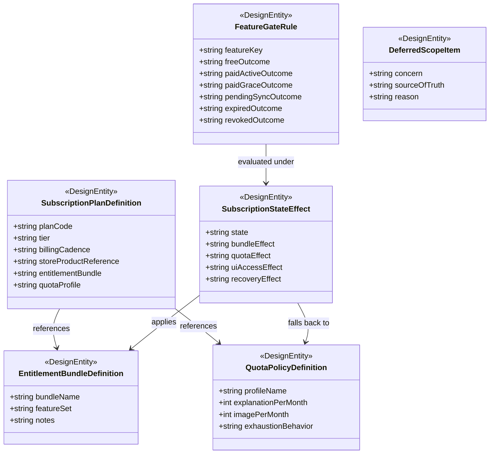

# Data Model: 課金 Product / Entitlement Policy 設計

## Policy Package Overview

## Entity: SubscriptionPlanDefinition

**Purpose**: canonical plan catalog と、plan ごとの store product 参照、bundle、quota profile を定義する。

| Field | Type | Cardinality | Description |
|-------|------|-------------|-------------|
| planCode | string | 1 | canonical plan code |
| tier | string | 1 | `free` または `premium` |
| billingCadence | string | 1 | `none` または `monthly` |
| storeProductReference | string | 0..1 | store purchase に使う canonical product 参照 |
| entitlementBundle | string | 1 | 紐づく entitlement bundle 名 |
| quotaProfile | string | 1 | 紐づく quota profile 名 |

**Validation rules**:

- `free` は `storeProductReference` を持ってはならない
- paid plan は一意な `storeProductReference` を持たなければならない
- `standard-monthly` と `pro-monthly` は同じ `entitlementBundle` を参照しなければならない
- `billingCadence` は初期 scope では `none` または `monthly` に限る

## Entity: EntitlementBundleDefinition

**Purpose**: plan が解放する feature set を表す。

| Field | Type | Cardinality | Description |
|-------|------|-------------|-------------|
| bundleName | string | 1 | canonical bundle 名 |
| featureSet | string | 1 | 許可される feature key 集合 |
| notes | string | 0..1 | 補足説明 |

**Validation rules**:

- `standard-monthly` と `pro-monthly` は同一 bundle を共有しなければならない
- bundle 差分と quota 差分を同じ concern として二重定義してはならない
- feature key は `feature-gate-matrix-contract.md` の canonical key を参照しなければならない

## Entity: QuotaPolicyDefinition

**Purpose**: plan または tier ごとの explanation / image 利用上限を定義する。

| Field | Type | Cardinality | Description |
|-------|------|-------------|-------------|
| profileName | string | 1 | quota profile 名 |
| explanationPerMonth | int | 1 | 月次 explanation 上限 |
| imagePerMonth | int | 1 | 月次 image 上限 |
| exhaustionBehavior | string | 1 | 上限到達時の user-facing fallback |

**Validation rules**:

- すべての quota profile は月次リセット前提でなければならない
- `imagePerMonth` は負値を取ってはならない
- `pro` の各上限は `standard` 以上、`standard` の各上限は `free` 以上でなければならない

## Entity: FeatureGateRule

**Purpose**: feature key ごとに、plan tier と subscription state に応じた allow / limited / deny を定義する。

| Field | Type | Cardinality | Description |
|-------|------|-------------|-------------|
| featureKey | string | 1 | canonical feature key |
| freeOutcome | string | 1 | `free` tier の baseline outcome |
| paidActiveOutcome | string | 1 | paid active の outcome |
| paidGraceOutcome | string | 1 | paid grace の outcome |
| pendingSyncOutcome | string | 1 | `pending-sync` の safe fallback outcome |
| expiredOutcome | string | 1 | `expired` の fallback outcome |
| revokedOutcome | string | 1 | `revoked` の hard-stop outcome |

**Validation rules**:

- `pendingSyncOutcome` は premium-only allow を返してはならない
- `expiredOutcome` は `freeOutcome` を超える権限を返してはならない
- `revokedOutcome` は `subscription-status-access` と `restore-access` を除き `deny` でなければならない

## Entity: SubscriptionStateEffect

**Purpose**: subscription state が bundle、quota、UI access、recovery に与える影響を定義する。

| Field | Type | Cardinality | Description |
|-------|------|-------------|-------------|
| state | string | 1 | canonical subscription state |
| bundleEffect | string | 1 | どの entitlement bundle を適用するか |
| quotaEffect | string | 1 | どの quota profile を適用するか |
| uiAccessEffect | string | 1 | UI での遷移 / access 方針 |
| recoveryEffect | string | 1 | paywall / restore / restricted の導線 |

**Validation rules**:

- `grace` は paid bundle と paid quota profile を維持しなければならない
- `pending-sync` は premium bundle を新規付与してはならず、safe fallback を使わなければならない
- `expired` は free profile fallback を使わなければならない
- `revoked` は hard-stop と `Restricted` 導線を伴わなければならない

## Entity: DeferredScopeItem

**Purpose**: 014 が ownership を持たない billing concern と、その正本を示す。

| Field | Type | Cardinality | Description |
|-------|------|-------------|-------------|
| concern | string | 1 | deferred concern 名 |
| sourceOfTruth | string | 1 | 正本となる feature または外部境界 |
| reason | string | 1 | 今回扱わない理由 |

**Validation rules**:

- deferred concern には必ず source-of-truth を付ける
- in-scope policy と deferred concern の責務を二重定義してはならない

## Canonical Plan Catalog

| Plan Code | Tier | Billing Cadence | Store Product Reference | Entitlement Bundle | Quota Profile |
|-----------|------|-----------------|-------------------------|--------------------|---------------|
| `free` | `free` | `none` | none | `free-basic` | `free-monthly` |
| `standard-monthly` | `premium` | `monthly` | `vocastock.standard.monthly` | `premium-generation` | `standard-monthly` |
| `pro-monthly` | `premium` | `monthly` | `vocastock.pro.monthly` | `premium-generation` | `pro-monthly` |

## Canonical Entitlement Bundles

| Bundle Name | Included Feature Keys | Notes |
|-------------|-----------------------|-------|
| `free-basic` | `catalog-viewing`, `vocabulary-registration`, `explanation-generation`, `image-generation`, `completed-result-viewing`, `subscription-status-access`, `restore-access` | generation は quota 前提で limited access |
| `premium-generation` | `catalog-viewing`, `vocabulary-registration`, `explanation-generation`, `image-generation`, `completed-result-viewing`, `subscription-status-access`, `restore-access` | free と同じ feature set を持つが、paid quota profile を適用できる |

## Canonical Quota Profiles

| Profile Name | Explanation Per Month | Image Per Month | Exhaustion Behavior |
|--------------|-----------------------|-----------------|---------------------|
| `free-monthly` | 10 | 3 | upsell 導線付き `limited` |
| `standard-monthly` | 100 | 30 | status 表示付き `limited` |
| `pro-monthly` | 300 | 100 | status 表示付き `limited` |

## Canonical Feature Keys

| Feature Key | Meaning |
|-------------|---------|
| `catalog-viewing` | 一覧や catalog を閲覧する |
| `vocabulary-registration` | `VocabularyExpression` を登録する |
| `explanation-generation` | explanation generation を開始する |
| `image-generation` | image generation を開始する |
| `completed-result-viewing` | completed explanation / image を閲覧する |
| `subscription-status-access` | `SubscriptionStatus` を閲覧する |
| `restore-access` | restore / refresh / recovery を開始する |

## Subscription State Effects

| State | Bundle Effect | Quota Effect | UI Access Effect | Recovery Effect |
|-------|---------------|--------------|------------------|-----------------|
| `active` | paid plan の bundle を適用 | paid plan の quota profile を適用 | 通常利用継続 | 通常の subscription status |
| `grace` | paid plan の bundle を維持 | paid plan の quota profile を維持 | 通常利用継続 | 支払い猶予の説明を表示 |
| `pending-sync` | confirmed premium bundle を新規付与しない | `free-monthly` へ safe fallback | 状態表示は許可、premium 断定は不可 | refresh / restore を促す |
| `expired` | `free-basic` へ戻す | `free-monthly` へ戻す | completed result は許可、premium upsell を表示 | paywall / restore を促す |
| `revoked` | premium / free の通常 bundle 表示を中断 | execution 不可 | `Restricted` へ送る | recovery section のみ許可 |

## Source-of-Truth Alignment

| Concern | Source of Truth | Why 014 References It |
|---------|-----------------|-----------------------|
| subscription authority boundary | `/Users/lihs/workspace/vocastock/specs/010-subscription-component-boundaries/` | authority と mirror の ownership を再定義しないため |
| command acceptance / messaging | `/Users/lihs/workspace/vocastock/specs/011-api-command-io-design/` | quota exhaustion や gate deny の command / message 連携を壊さないため |
| workflow / persistence ordering | `/Users/lihs/workspace/vocastock/specs/012-persistence-workflow-design/` | purchase verification と notification reconciliation の state progression を再定義しないため |
| UI access / recovery | `/Users/lihs/workspace/vocastock/specs/013-flutter-ui-state-design/` | `Paywall` / `Restricted` / `SubscriptionStatus` の access policy と整合させるため |

## Deferred Scope

| Concern | Source Of Truth | Reason |
|---------|-----------------|--------|
| pricing amount / currency | store catalog / business operation | 商用施策であり policy package の責務外 |
| tax / invoicing | finance / store policy | 会計ルールは 014 の対象外 |
| refund policy | support / store policy | product catalog と別 concern |
| coupon / intro offer / family plan | future billing feature | 初期 catalog を複雑化しすぎるため |
| vendor SDK detail | 010 external adapters / implementation | boundary は 010 で固定済み |
