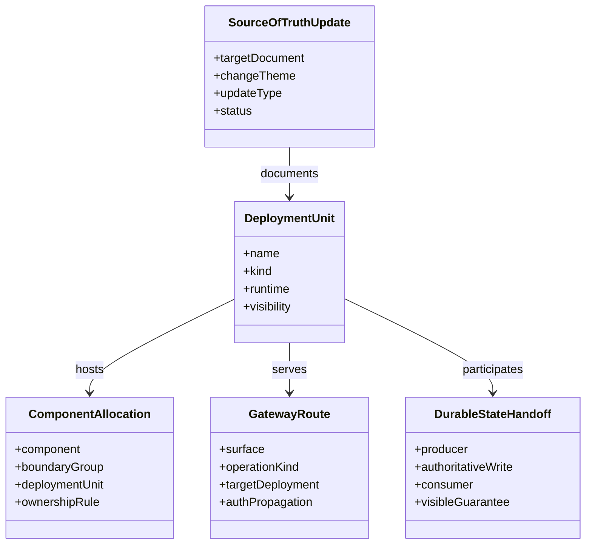

# Data Model: Command/Query Deployment Topology

## Overview

本 feature の主要エンティティは domain aggregate ではなく、deployment topology を
表現する設計エンティティである。

## Entities

### DeploymentUnit

**Purpose**: client、gateway、backend service、worker、managed service のように、
物理的に分離して配置 / 運用する単位を表す。

| Field | Type | Description |
|-------|------|-------------|
| `name` | string | `graphql-gateway`、`command-api`、`query-api` などの unit 名 |
| `kind` | enum | `client`, `gateway`, `service`, `worker`, `managed-service` |
| `runtime` | string | Flutter、Rust on Cloud Run、Haskell on Cloud Run、Firebase など |
| `visibility` | enum | `client-facing`, `internal`, `managed` |
| `owns` | list | 主責務一覧 |
| `mustNotOwn` | list | 非責務一覧 |

**Validation Rules**:

- `command-api` と `query-api` は同一 `DeploymentUnit` で表現してはならない
- `graphql-gateway` は `client-facing` であり、workflow 実行責務を持ってはならない
- `worker` 系 unit は query response を直接返してはならない

### ComponentAllocation

**Purpose**: architecture component を deployment unit へ割り当てる対応関係を表す。

| Field | Type | Description |
|-------|------|-------------|
| `component` | string | `Command Intake`, `Query Read`, `Explanation Generation Workflow` など |
| `boundaryGroup` | string | 009 / 010 の boundary group |
| `deploymentUnit` | string | 配置先 unit 名 |
| `ownershipRule` | string | その unit で持つ責務の要約 |
| `nonOwnershipRule` | string | その unit で持たない責務の要約 |

**Validation Rules**:

- `Command Intake` は `command-api` 以外へ primary allocation してはならない
- `Query Read` は `query-api` 以外へ primary allocation してはならない
- `Entitlement Policy`、`Subscription Feature Gate`、`Usage Metering / Quota Gate` は
  `internal-policy` として service / worker 内部に配置し、独立 unit にしない

### GatewayRoute

**Purpose**: client から見える unified GraphQL endpoint と、内部 routing の規則を表す。

| Field | Type | Description |
|-------|------|-------------|
| `surface` | string | `unified-graphql` |
| `operationKind` | enum | `mutation`, `query` |
| `targetDeployment` | string | `command-api` または `query-api` |
| `authPropagation` | string | auth header / request context の伝播方式 |
| `visibilityGuarantee` | string | query / mutation 応答で守る表示規則 |

**Validation Rules**:

- `mutation` は `command-api` 以外へ primary route してはならない
- `query` は `query-api` 以外へ primary route してはならない
- gateway は actor handoff の最終正本になってはならない

### DurableStateHandoff

**Purpose**: command write と query read の間を direct call ではなく durable state 経由で
接続する受け渡しを表す。

| Field | Type | Description |
|-------|------|-------------|
| `producer` | string | `command-api` または worker |
| `authoritativeWrite` | string | Firestore authoritative write / workflow state update |
| `consumer` | string | `query-api` |
| `projectionType` | string | read projection / status projection / entitlement mirror |
| `visibleGuarantee` | string | projection lag 中の user-visible guarantee |

**Validation Rules**:

- `consumer` は completed result を authoritative write より先に返してはならない
- projection lag 中は `status-only` を返してよいが provisional completed payload を返してはならない

### SourceOfTruthUpdate

**Purpose**: topology 変更をどの正本へ反映するかを表す更新マップを表現する。

| Field | Type | Description |
|-------|------|-------------|
| `targetDocument` | string | `docs/external/adr.md` など |
| `changeTheme` | string | topology, stack, routing, update map など |
| `updateType` | enum | `canonical-sync`, `artifact-resync`, `deferred-reference` |
| `status` | enum | `required`, `conditional`, `deferred` |

**Validation Rules**:

- `docs/external/adr.md` と `docs/external/requirements.md` は `required` でなければならない
- 正本を変更する判断がある場合、関連 spec package を `artifact-resync` か `deferred-reference` の
  いずれかへ分類しなければならない

## Canonical Deployment Units

| Unit | Kind | Runtime | Visibility | Primary Role |
|------|------|---------|------------|--------------|
| `mobile-client` | `client` | Flutter | `client-facing` | UI と GraphQL 呼び出し |
| `graphql-gateway` | `gateway` | GraphQL over Cloud Run front | `client-facing` | unified endpoint と routing |
| `command-api` | `service` | Rust on Cloud Run | `internal` | command acceptance / write / dispatch |
| `query-api` | `service` | Rust on Cloud Run | `internal` | completed result / status / subscription read |
| `explanation-worker` | `worker` | Haskell on Cloud Run | `internal` | explanation workflow |
| `image-worker` | `worker` | Haskell on Cloud Run | `internal` | image workflow |
| `billing-worker` | `worker` | backend reconciliation worker on Cloud Run | `internal` | purchase verification / notification reconciliation |
| `firebase-auth` | `managed-service` | Firebase Authentication | `managed` | identity baseline |
| `firestore-state` | `managed-service` | Cloud Firestore | `managed` | authoritative write / projection store |
| `pubsub-runtime` | `managed-service` | Google Cloud Pub/Sub | `managed` | async trigger |
| `drive-asset-store` | `managed-service` | Google Drive | `managed` | stable asset storage |

## Core Flows

### Registration / Generation Start

1. `mobile-client` calls `graphql-gateway`
2. `graphql-gateway` routes mutation to `command-api`
3. `command-api` verifies token, resolves actor, writes authoritative state, dispatches workflow
4. `command-api` returns `accepted / status handle`
5. `query-api` reads status projection until completed result exists

### Completed Explanation / Image Read

1. `mobile-client` calls `graphql-gateway`
2. `graphql-gateway` routes query to `query-api`
3. `query-api` verifies token, resolves actor, reads projection
4. `query-api` returns completed result or status-only

### Subscription Status / Gate Read

1. `mobile-client` calls `graphql-gateway`
2. `graphql-gateway` routes query to `query-api`
3. `query-api` returns authoritative subscription read, entitlement mirror, usage allowance, gate result
4. `billing-worker` updates authoritative state asynchronously through verification / notification flows
