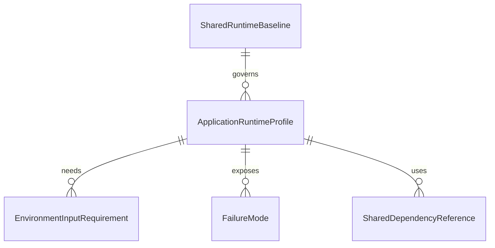

# Data Model: Application Container Environments

## Entities

### ApplicationRuntimeProfile

**Purpose**: 1 つの deployable application に対応する container 実行契約を表す。

| Field | Type | Required | Description |
|-------|------|----------|-------------|
| `applicationName` | string | yes | `graphql-gateway`、`command-api` などの canonical application 名 |
| `applicationCategory` | string | yes | `api-service` または `worker` |
| `runtimeFamily` | string | yes | Rust service runtime、workflow worker runtime などの family |
| `dockerfilePath` | string | yes | application-scoped Dockerfile の配置先 |
| `buildTarget` | string | yes | local / CI で共有する build target 名 |
| `entryContract` | string | yes | container 起動時に満たすべき entrypoint / command 契約 |
| `successSignal` | string | yes | readiness endpoint 応答、stable-run など canonical success signal |
| `requiredInputs` | EnvironmentInputRequirement[] | yes | 起動に必須な runtime input |
| `optionalInputs` | EnvironmentInputRequirement[] | yes | 省略可能な runtime input |
| `sharedDependencies` | SharedDependencyReference[] | yes | repository-wide shared dependency stack への参照 |
| `failureModes` | FailureMode[] | yes | 切り分け対象となる典型 failure mode |

**Validation Rules**:

- `applicationName` は 015 の topology catalog と一致しなければならない
- `dockerfilePath` は `docker/applications/<application>/Dockerfile` を指し、shared dependency stack 配下を指してはならない
- `applicationCategory = api-service` の場合、`successSignal` は `HTTP readiness endpoint` でなければならない
- `applicationCategory = worker` の場合、`successSignal` は stable-run 系でなければならず、HTTP endpoint 必須を含めてはならない

### SharedRuntimeBaseline

**Purpose**: 複数 application が共有する container 実行上の baseline を表す。

| Field | Type | Required | Description |
|-------|------|----------|-------------|
| `baselineName` | string | yes | shared runtime baseline の識別名 |
| `sharedBuildContract` | string | yes | Dockerfile / target / entry contract の共有方針 |
| `composePath` | string | yes | local orchestration compose の配置先 |
| `envTemplatePath` | string | yes | committed な env template の配置先 |
| `separatedDependencyStacks` | string[] | yes | application profile と分けて扱う shared dependency stack |

**Validation Rules**:

- `composePath` は `docker/applications/compose.yaml` を正本とする
- `envTemplatePath` は committed example ファイルを指し、ローカル override を直接指してはならない
- `separatedDependencyStacks` には `docker/firebase/` が含まれなければならない

### EnvironmentInputRequirement

**Purpose**: container 起動時に必要な環境入力を表す。

| Field | Type | Required | Description |
|-------|------|----------|-------------|
| `inputName` | string | yes | canonical input 名 |
| `inputCategory` | string | yes | `secret`、`local-default`、`runtime-parameter` のいずれか |
| `required` | boolean | yes | 起動に必須かどうか |
| `scope` | string | yes | `application-only` または `shared` |
| `sourceBoundary` | string | yes | example file、CI secret store など入力の出所境界 |
| `failureBehavior` | string | yes | 入力欠落時の expected failure |

**Validation Rules**:

- `required = true` の入力は `failureBehavior` を必須とする
- `inputCategory = secret` の入力は committed local default にしてはならない
- `scope = shared` の入力は shared dependency stack か `docker/applications/env/.env.example` へ集約されなければならない

### FailureMode

**Purpose**: runtime contract から期待される典型 failure path を表す。

| Field | Type | Required | Description |
|-------|------|----------|-------------|
| `modeName` | string | yes | failure mode 名 |
| `trigger` | string | yes | 何が原因で発生するか |
| `observableSignal` | string | yes | log / readiness failure / process exit などの観測 signal |
| `operatorAction` | string | yes | 切り分けや回復の導線 |

### SharedDependencyReference

**Purpose**: application profile が依存する repository-wide shared dependency stack を表す。

| Field | Type | Required | Description |
|-------|------|----------|-------------|
| `dependencyName` | string | yes | shared dependency 名 |
| `path` | string | yes | source-of-truth path |
| `usageMode` | string | yes | `local-only`、`shared-local`、`shared-ci` など |

## Relationship Overview

## Initial Catalog

| Application | Category | Success Signal | Shared Dependency |
|-------------|----------|----------------|------------------|
| `graphql-gateway` | `api-service` | `HTTP readiness endpoint` | `docker/firebase/` outside profile |
| `command-api` | `api-service` | `HTTP readiness endpoint` | `docker/firebase/` outside profile |
| `query-api` | `api-service` | `HTTP readiness endpoint` | `docker/firebase/` outside profile |
| `explanation-worker` | `worker` | `stable long-running consumer` | `docker/firebase/` outside profile |
| `image-worker` | `worker` | `stable long-running consumer` | `docker/firebase/` outside profile |
| `billing-worker` | `worker` | `stable long-running consumer` | `docker/firebase/` outside profile |
