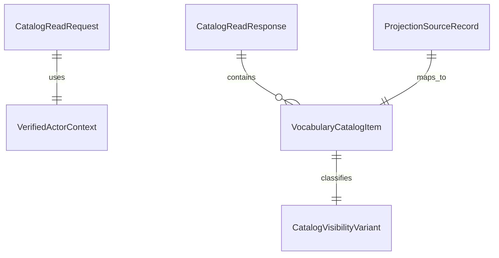

# Data Model: Query Catalog Read

## Entities

### CatalogReadRequest

**Purpose**: `query-api` が actor 文脈付きで `VocabularyCatalogProjection` を読むための入力単位を表す。

| Field | Type | Required | Description |
|-------|------|----------|-------------|
| `actorContext` | VerifiedActorContext | yes | token verification 後に確定した read 対象 actor |
| `projectionFreshness` | string | yes | `eventual` 固定。strong read-after-write を要求しない |
| `includeStatusReason` | boolean | yes | status-only 理由の summary を返すかどうか |

**Validation Rules**:

- `actorContext` は active session を持つ completed handoff でなければならない
- `projectionFreshness` は `eventual` とし、authoritative write 直後の completed 保証を要求してはならない

### VerifiedActorContext

**Purpose**: `shared-auth` を再利用して catalog read の対象 actor を決める completed auth/session 文脈を表す。

| Field | Type | Required | Description |
|-------|------|----------|-------------|
| `actor` | string | yes | read projection の所有主体 |
| `authAccount` | string | yes | auth account 参照 |
| `session` | string | yes | session 参照 |
| `sessionState` | string | yes | `active` または `reauth-required` |

**Validation Rules**:

- raw token、provider credential、session secret を保持してはならない
- `sessionState = reauth-required` の場合、catalog read を成功させてはならない

### VocabularyCatalogItem

**Purpose**: catalog 一覧の 1 項目を表す。

| Field | Type | Required | Description |
|-------|------|----------|-------------|
| `vocabularyExpression` | string | yes | catalog 項目の対象参照 |
| `registrationState` | string | yes | 語彙の登録状態 summary |
| `explanationState` | string | yes | explanation 側の app-facing summary state |
| `visibility` | CatalogVisibilityVariant | yes | completed summary か status-only か |
| `completedSummary` | string | no | completed 時だけ返す summary |
| `statusReason` | string | no | status-only 時だけ返す理由 summary |

**Validation Rules**:

- `visibility = completed-summary` の場合だけ `completedSummary` を持てる
- `visibility = status-only` の場合は `completedSummary` を持ってはならない
- detail 本文や image payload を保持してはならない

### CatalogVisibilityVariant

**Purpose**: catalog 項目の可視性ルールを正規化する。

| Value | Meaning |
|-------|---------|
| `completed-summary` | `currentExplanation` 参照が成立し、catalog で見せてよい summary を返せる |
| `status-only` | workflow 未完了、失敗、stale read、projection lag などにより summary だけを返す |

**Validation Rules**:

- provisional completed payload を表す中間値を追加してはならない
- `status-only` は pending、running、retry-scheduled、timed-out、failed-final、dead-lettered を包含できなければならない

### ProjectionSourceRecord

**Purpose**: in-memory / stub source が返す raw projection 情報を表す。

| Field | Type | Required | Description |
|-------|------|----------|-------------|
| `vocabularyExpression` | string | yes | 対象語彙参照 |
| `registrationState` | string | yes | 登録状態 |
| `latestWorkflowState` | string | yes | latest explanation workflow の状態 |
| `currentExplanationAvailable` | boolean | yes | `currentExplanation` 参照可否 |
| `completedSummary` | string | no | 完了時 summary |

**Validation Rules**:

- `currentExplanationAvailable = true` の場合のみ `completedSummary` を持てる
- `latestWorkflowState = succeeded` でも `currentExplanationAvailable = false` なら completed と見なしてはならない

### CatalogReadResponse

**Purpose**: catalog endpoint が返す collection 単位の出力を表す。

| Field | Type | Required | Description |
|-------|------|----------|-------------|
| `items` | VocabularyCatalogItem[] | yes | catalog 一覧 |
| `collectionState` | string | yes | `empty` または `populated` |
| `projectionFreshness` | string | yes | `eventual` |

**Validation Rules**:

- `items` が空でも失敗扱いにしてはならない
- `projectionFreshness` は app-facing visibility guarantee を反転させてはならない

## Relationship Overview

## Mapping Rules

| Source Condition | Catalog Item Result |
|------------------|--------------------|
| `currentExplanationAvailable = true` | `completed-summary` |
| `currentExplanationAvailable = false` + `latestWorkflowState` in `queued/running/retry-scheduled` | `status-only` |
| `currentExplanationAvailable = false` + `latestWorkflowState` in `timed-out/failed-final/dead-lettered` | `status-only` |
| `items = []` | `collectionState = empty` |

## Initial Slice Notes

- `ProjectionSourceRecord` は initial slice では in-memory / stub でよい
- `VocabularyCatalogItem` は `VocabularyExpressionDetail` 用 detail payload を保持しない
- `pending-sync` の entitlement mirror は catalog item の completed 判定に使わない
