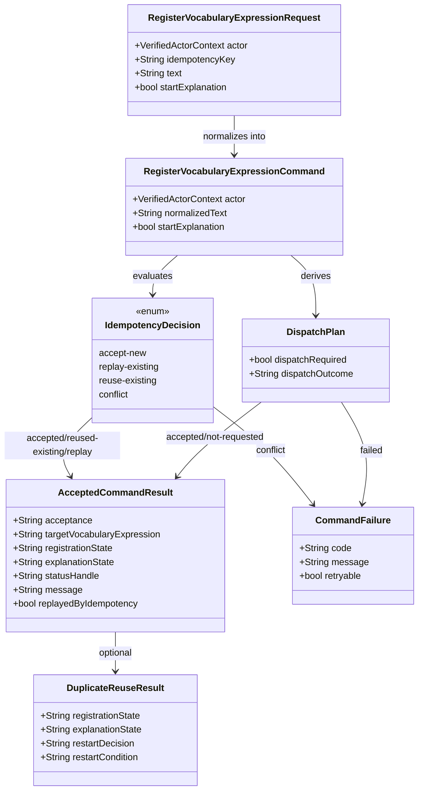

# Data Model: Command API Implementation

## Overview

018 は `registerVocabularyExpression` の command acceptance slice に限定する。domain aggregate
そのものは変更せず、`command-api` が受け取る request、返す accepted / failure 結果、
idempotency 判定、dispatch 一貫性を表す実装内モデルを定義する。

## Entities

### RegisterVocabularyExpressionRequest

**Purpose**: `command-api` が内部 route で受け取る登録 command request を表す。

| Field | Type | Cardinality | Notes |
|-------|------|-------------|-------|
| `actor` | `VerifiedActorContext` | 1 | `shared-auth` 由来の completed handoff |
| `idempotencyKey` | `String` | 1 | actor 単位で一意に扱う |
| `text` | `String` | 1 | 正規化前の登録対象 |
| `startExplanation` | `bool` | 1 | omitted 時は `true` とみなす |

**Validation rules**:
- `text` は空文字、空白のみ、過剰な control character を許可しない
- `startExplanation = false` を許可するのはこの request のみ
- `actor.sessionState` は active 系でなければならない

### RegisterVocabularyExpressionCommand

**Purpose**: request を正規化し、idempotency / duplicate reuse / dispatch 判定に使う command 内表現。

| Field | Type | Cardinality | Notes |
|-------|------|-------------|-------|
| `actor` | `VerifiedActorContext` | 1 | command ownership 判定の基準 |
| `normalizedText` | `String` | 1 | duplicate registration 判定の基準 |
| `startExplanation` | `bool` | 1 | explanation 開始抑止を保持 |

**Validation rules**:
- `normalizedText` は deterministic に導出されなければならない
- same-request replay は `actor + idempotencyKey + normalizedText + startExplanation` で判定する

### IdempotencyDecision

**Purpose**: replay / duplicate / conflict を区別する command-side 判定結果。

| Variant | Meaning |
|---------|---------|
| `accept-new` | 新規 request として受理できる |
| `replay-existing` | same-request replay で既知結果を返す |
| `reuse-existing` | 別 key だが既存登録対象を再利用する |
| `conflict` | same key で異なる正規化 request のため拒否する |

**Rules**:
- `replay-existing` は新しい dispatch を起こしてはならない
- `reuse-existing` は business duplicate であり、same-request replay とは別概念
- `conflict` は `idempotency-conflict` error へ写像する

### AcceptedCommandResult

**Purpose**: `accepted` または `reused-existing` の success response を表す。

| Field | Type | Cardinality | Notes |
|-------|------|-------------|-------|
| `acceptance` | `AcceptanceOutcome` | 1 | `accepted` or `reused-existing` |
| `targetVocabularyExpression` | `String` | 1 | 返却対象参照 |
| `registrationState` | `String` | 1 | 登録状態要約 |
| `explanationState` | `String` | 1 | explanation 状態要約 |
| `statusHandle` | `String` | 1 | query-side status 参照ハンドル |
| `message` | `String` | 1 | user-facing message |
| `replayedByIdempotency` | `bool` | 1 | same-request replay か |
| `duplicateReuse` | `DuplicateReuseResult` | 0..1 | duplicate registration 補足 |

**Visibility rules**:
- explanation 本文、image payload、query projection payload を含めてはならない
- accepted は dispatch 成功後にのみ返せる

### DuplicateReuseResult

**Purpose**: 既存登録対象を返した理由と再開可否の要約を表す。

| Field | Type | Cardinality | Notes |
|-------|------|-------------|-------|
| `registrationState` | `String` | 1 | 現在の登録状態 |
| `explanationState` | `String` | 1 | 現在の explanation 状態 |
| `restartDecision` | `String` | 1 | `restart-accepted` or `restart-suppressed` |
| `restartCondition` | `String` | 1 | 判定理由 |

**Rules**:
- `startExplanation = false` の場合は `restart-suppressed` に固定する
- 007 の rule に従い、既存状態が `not-started` または `failed` かつ開始抑止なしのときだけ `restart-accepted`

### CommandFailure

**Purpose**: `command-api` が返す stable failure envelope を表す。

| Field | Type | Cardinality | Notes |
|-------|------|-------------|-------|
| `code` | `String` | 1 | `validation-failed` など |
| `message` | `String` | 1 | user-facing message |
| `retryable` | `bool` | 1 | 再試行可否 |
| `targetVocabularyExpression` | `String` | 0..1 | 安全に返せるときのみ |
| `registrationState` | `String` | 0..1 | 安全に返せるときのみ |
| `explanationState` | `String` | 0..1 | 安全に返せるときのみ |

**Rules**:
- raw token、provider credential、dispatch detail を含めてはならない
- `dispatch-failed` は success envelope と同時に返してはならない

### DispatchPlan

**Purpose**: authoritative write 後に workflow dispatch を行うかどうかと、その整合性を表す。

| Field | Type | Cardinality | Notes |
|-------|------|-------------|-------|
| `dispatchRequired` | `bool` | 1 | `startExplanation` に依存 |
| `dispatchOutcome` | `String` | 1 | `not-requested` / `accepted` / `failed` |

**Rules**:
- `dispatchRequired = false` の場合は accepted を返してよい
- `dispatchRequired = true` で `dispatchOutcome = failed` の場合は `dispatch-failed` を返し、accepted を返してはならない

## Relationships

